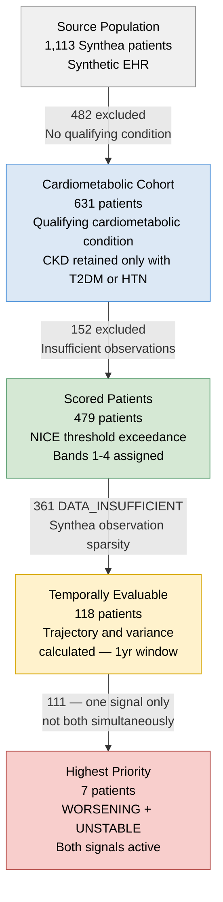
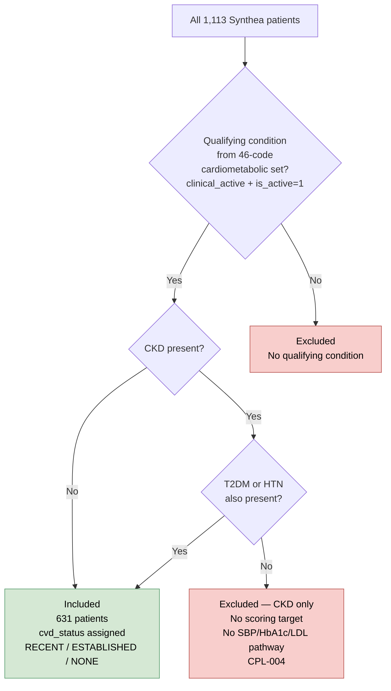
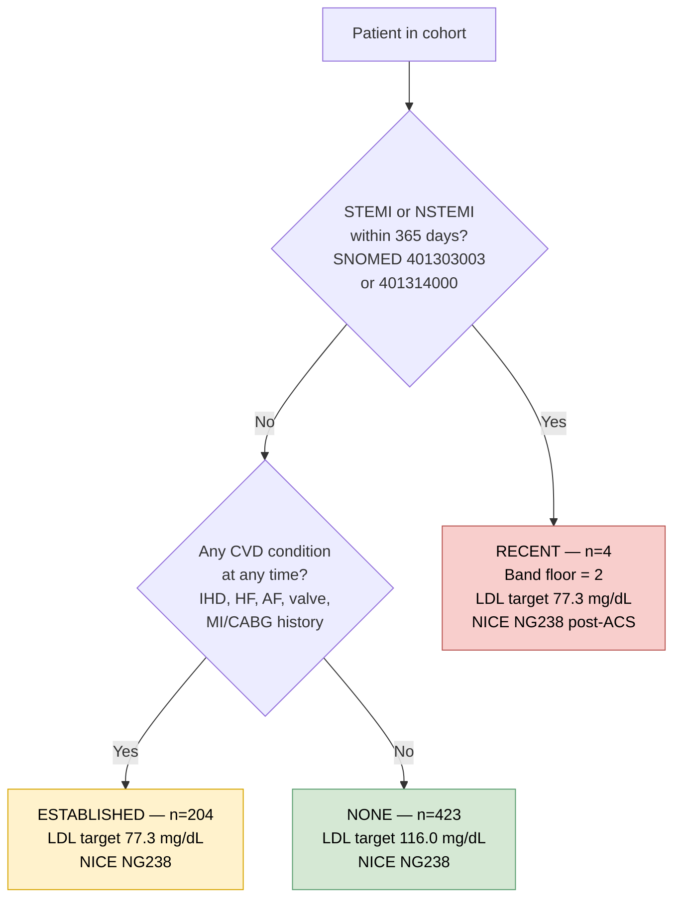
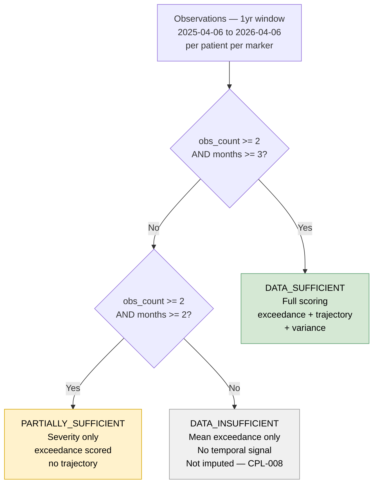
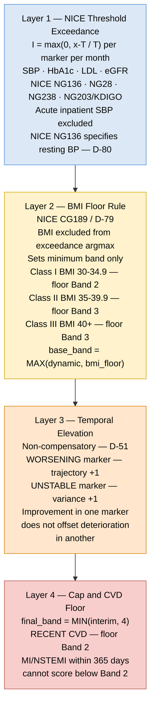
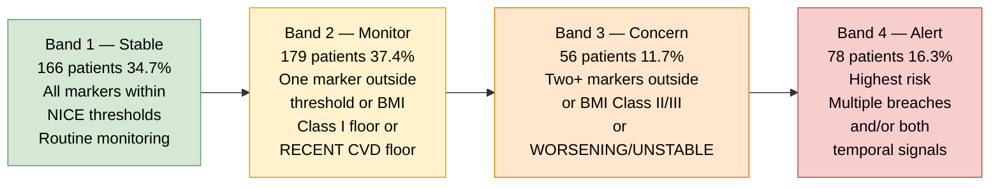
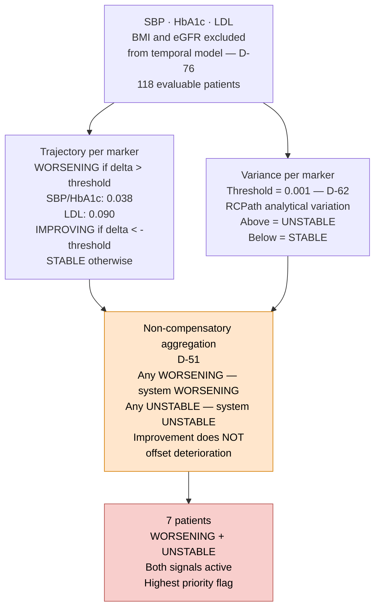
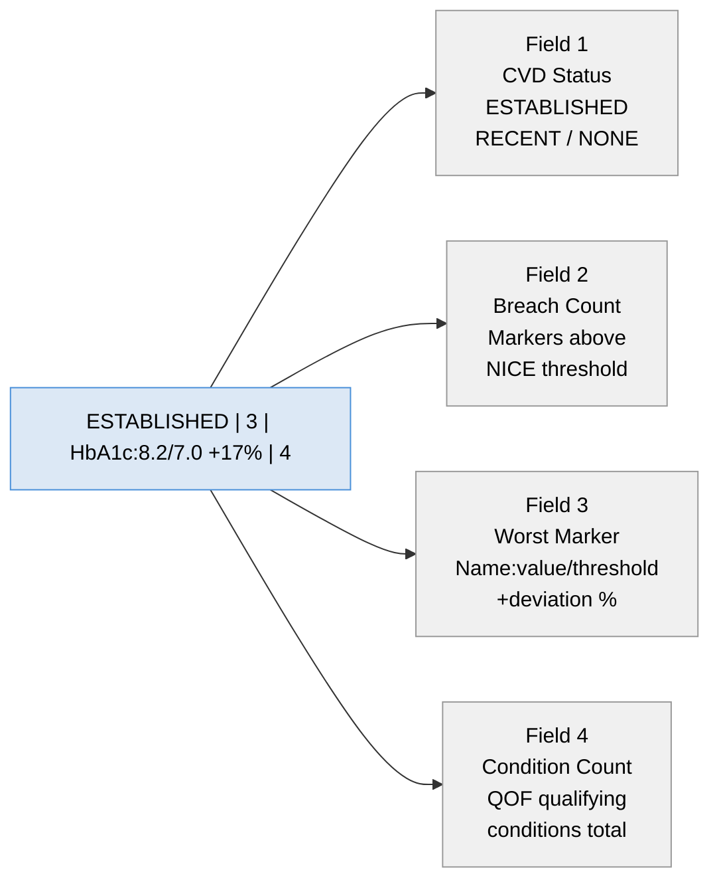
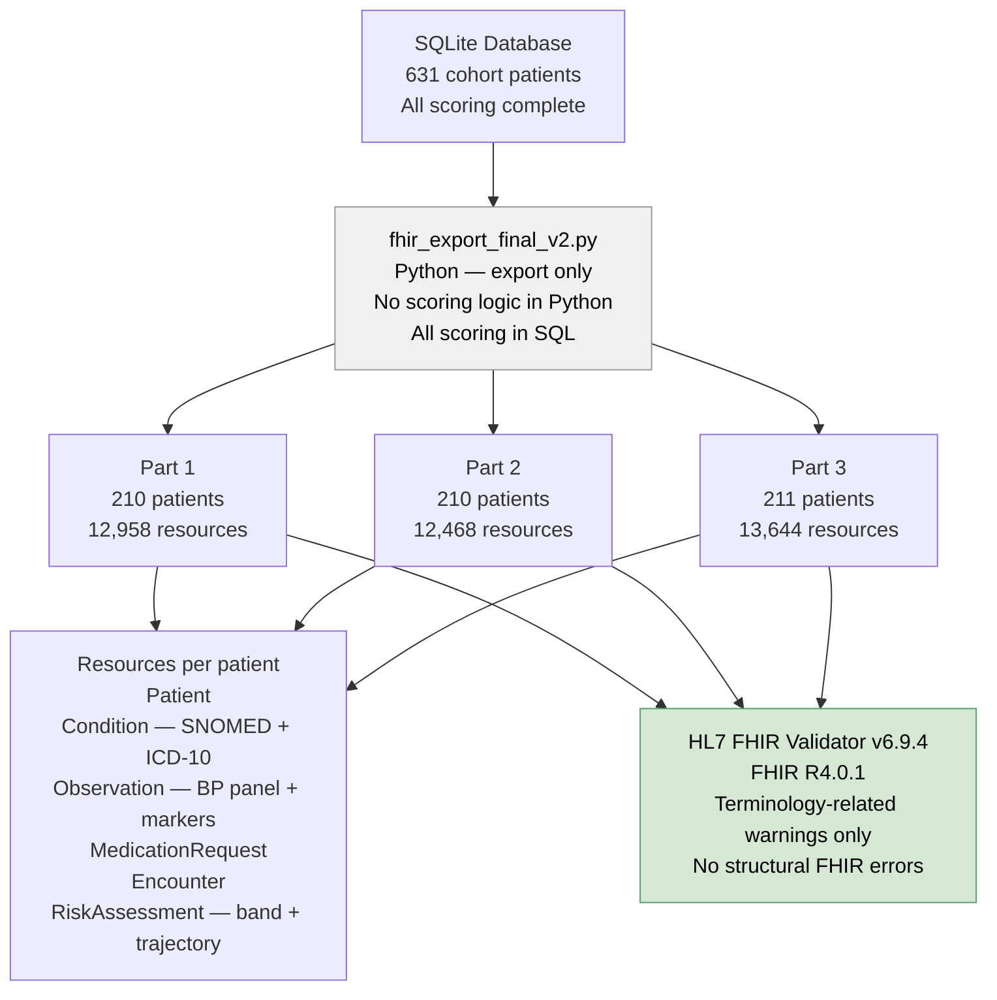
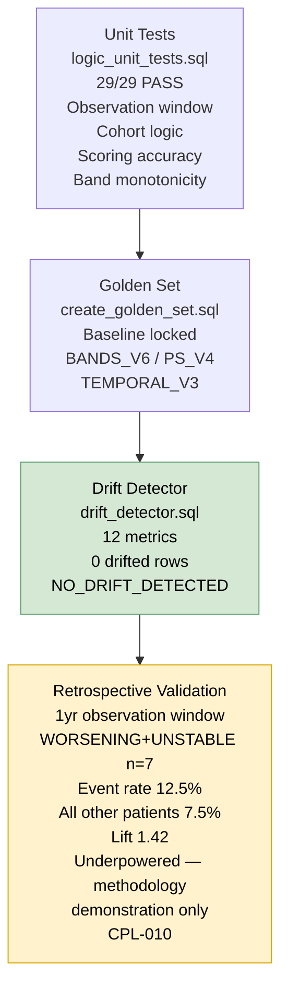

## TL;DR

- Built a rule-based cardiometabolic deterioration monitoring system (SQL + Python + FHIR)
- 631-patient synthetic cohort (Synthea)
- 4-layer scoring: threshold exceedance → BMI floor → temporal signals → clinical caps
- Identifies high-risk patients via WORSENING + UNSTABLE trajectories
- FHIR R4 export (39k+ resources), structurally valid
- Full validation pipeline: unit tests, golden set, drift detection
- Designed as a population prioritisation system, not diagnostic tool

---

## 1. Clinical Context

Cardiometabolic disease — encompassing Type 2 diabetes, cardiovascular disease, hypertension, and chronic kidney disease — represents the highest burden of morbidity and hospitalisation in NHS secondary care. Deterioration in this population is characterised by gradual biomarker trajectory changes across multiple domains simultaneously. Standard clinical monitoring is episodic and reactive. This system demonstrates a proactive, longitudinal monitoring architecture that aggregates biomarker signals into a structured risk stratification output using a one-year observation window.

---

## 2. Cohort Pipeline

---

## 3. Cohort Inclusion and Exclusion Logic

---

## 4. CVD Status Assignment

---

## 5. Data Sufficiency Tiers

---

## 6. Scoring Pipeline — Four Layers

---

## 7. Deterioration Band System

---

## 8. Temporal Signal Logic

---

## 9. Priority String

---

## 10. FHIR R4 Export Architecture

---

## 11. Validation Approach

---

## 12. Technical Stack

| Layer | Tool | Purpose |
|-------|------|---------|
| Primary language | SQL — SQLite / DB Browser | Cleaning, cohort, scoring, validation |
| Data ingestion | Python — load_data.py | Synthea CSVs into SQLite |
| Terminology loading | Python — load_snomed_map.py | MonolithRF2 SNOMED→ICD-10 |
| FHIR export | Python — fhir_export_final_v2.py | FHIR R4 Bundle JSON |
| Visualisation | Tableau Public | Clinical dashboards |
| Patient explorer | HTML/JS — GitHub Pages | Individual patient drill-down |
| Conditions | SNOMED CT MonolithRF2 GB_20260311 | Primary condition coding |
| Conditions | ICD-10 5th Edition | Secondary condition coding |
| Observations | LOINC | Biomarker coding |
| Medications | RxNorm | Medication coding |
| Thresholds | NICE NG136, NG28, NG238, NG203 | Exceedance thresholds |
| Thresholds | KDIGO 2012 | eGFR staging |
| Thresholds | NICE CG189 | BMI floor tiers |
| Thresholds | RCPath | Variance threshold D-62 |
| Interoperability | HL7 FHIR R4.0.1 | Export standard |

---

## 13. Clinical Problem Log — Summary

| Reference | Type | Summary |
|-----------|------|---------|
| CPL-001 | Architecture | Synthea used — UCLH unavailable, MIMIC-IV requires credentialing |
| CPL-002 | Architecture | RTT design pivoted — Synthea has no waiting list fields |
| CPL-003 | Clinical Rule | BMI floor rule — excluded from dynamic argmax — D-79 NICE CG189 |
| CPL-004 | Clinical Rule | Acute SBP excluded — NICE NG136 resting BP only — D-80 |
| CPL-005 | Clinical Rule | Variance threshold 0.001 — RCPath analytical variation — D-62 |
| CPL-006 | Clinical Rule | Non-compensatory aggregation — any signal fires system flag — D-51 |
| CPL-007 | Clinical Rule | Acute event scope — metabolic deterioration not plaque rupture |
| CPL-008 | Architecture | 361 DATA_INSUFFICIENT — flagged honestly, not imputed |
| CPL-009 | Clinical Rule | CKD-only excluded — no cardiometabolic scoring target |
| CPL-010 | Validation | Retrospective validation underpowered — methodology demonstration |

---

## 14. Information Governance

### Caldicott Principles

This project was designed in compliance with the Caldicott Principles. Only the five scoring biomarkers are used — no social, behavioural, or unnecessary demographic data. In real deployment, access would be restricted to the responsible clinical team. All data is Synthea synthetic EHR — no real patient data was used at any stage. The FHIR R4 export layer is designed to enable safe, structured data sharing in a real deployment context. Data was used only for the stated purpose of building and validating the scoring pipeline.

### DCB0129

DCB0129 (Clinical Risk Management in Health IT) would apply to any real deployment. This proof-of-concept would require a full clinical risk management file — hazard log, clinical risk assessment, and safety case report — before operational use.

### DPIA

A Data Protection Impact Assessment would be required under UK GDPR Article 35 before real deployment. Key considerations: legal basis, data minimisation, access controls, retention policy, and patient notification. No DPIA is required for this synthetic data project.

---

## 15. Known Limitations

| Limitation | Impact | Mitigation |
|------------|--------|------------|
| Synthea synthetic data | Observations procedurally generated | Explicitly proof-of-concept throughout |
| 75.4% DATA_INSUFFICIENT | 361 patients have no trajectory signal | Synthea sparsity — real EMIS/SystmOne would produce higher coverage |
| Retrospective validation underpowered | No statistical inference from n=7 | Methodology infrastructure is the evidence |
| Unit normalisation not applied | Mixed units within same LOINC | Thresholds calibrated to Synthea units |
| eGFR LOINC 33914-3 deprecated | CKD-EPI replacement not in Synthea | Retained with documentation |
| RxNorm medication coding | UK deployment uses dm+d | Synthea constraint — documented |

---

## 16. Disclaimer

Synthea-generated synthetic EHR data only. No real NHS patient data used or accessed. All identifiers are synthetic UUIDs. Not validated for clinical use. Not assessed under DCB0129. Must not be used for clinical decisions about real patients.

---

## 17. Patient Explorer

Interactive patient drill-down — search by ID, view band, trajectory, variance, marker scores.

**[Launch Patient Explorer](https://asadqurashi12.github.io/cardiometabolic-deterioration/explorer/)**

Features:
- Search by patient ID with autocomplete
- Deterioration band badge coloured by data sufficiency
- Scoring pathway breakdown
- Priority string with field annotations
- Marker scores table
- Monthly exceedance chart (SBP, HbA1c, LDL)
- WORSENING+UNSTABLE alert banner

*Pipeline: BANDS_V6 / PS_V4 / TEMPORAL_V3 — NO_DRIFT confirmed*
*FHIR: HL7 Validator v6.9.4, R4.0.1*
*Terminology: NHS Digital TRUD MonolithRF2 GB_20260311*
*Data: Synthea 1,113-patient cohort*