---

## 1. Clinical Context

Cardiometabolic disease — encompassing Type 2 diabetes, cardiovascular disease, hypertension, and chronic kidney disease — represents the highest burden of morbidity and hospitalisation in NHS secondary care. Deterioration in this population is characterised by gradual biomarker trajectory changes across multiple domains simultaneously. Standard clinical monitoring is episodic and reactive. This system demonstrates a proactive, longitudinal monitoring architecture that aggregates biomarker signals into a structured risk stratification output.

This is not a diagnostic tool. It is a population-level prioritisation system designed to surface patients whose biomarker trajectories warrant earlier clinical review, reducing the probability of unplanned emergency admission.

---

## 2. Cohort Pipeline

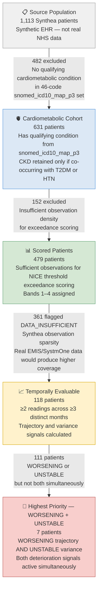

---

## 3. Cohort Inclusion and Exclusion Logic

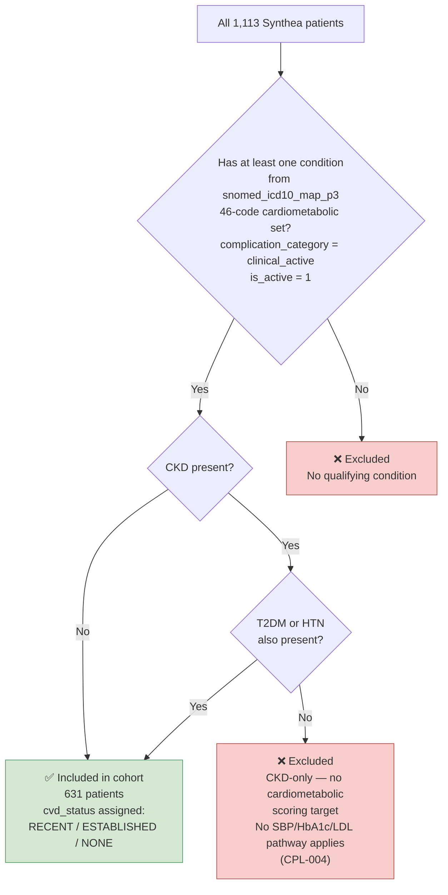

---

## 4. CVD Status Assignment

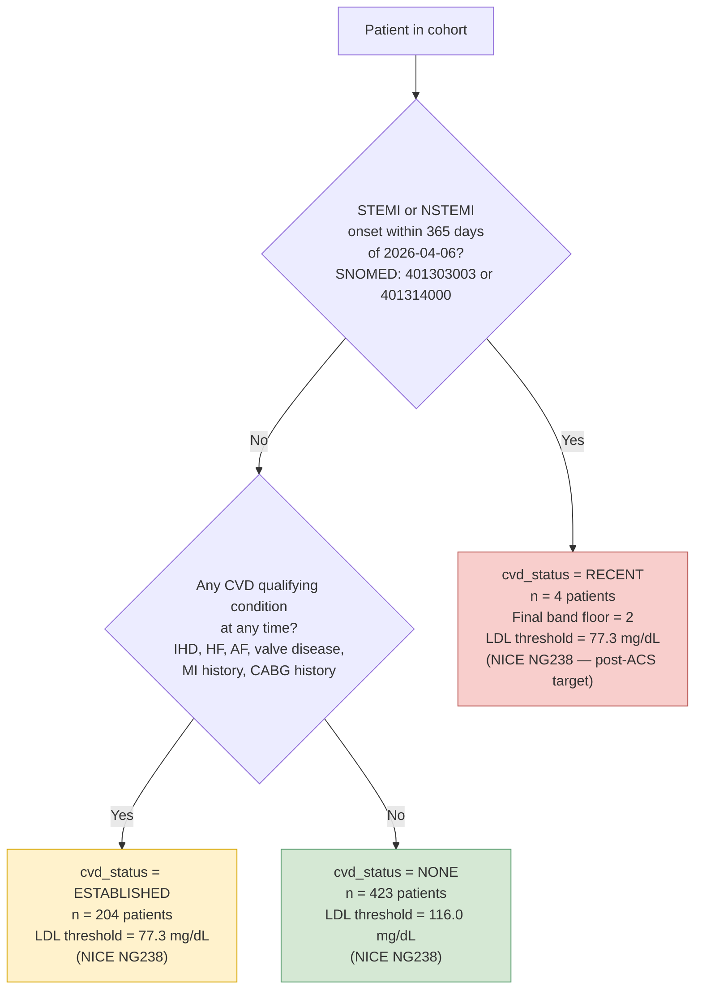

---

## 5. Data Sufficiency Tiers

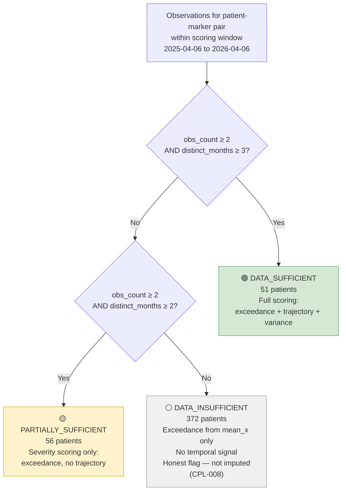

---

## 6. Scoring Pipeline — Four Layers

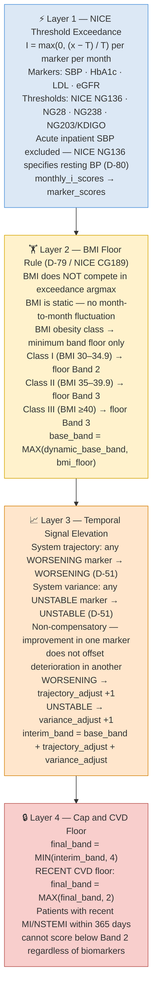

---

## 7. Deterioration Band System

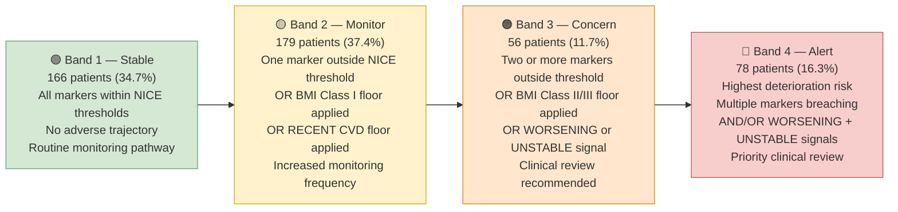

---

## 8. Temporal Signal Logic

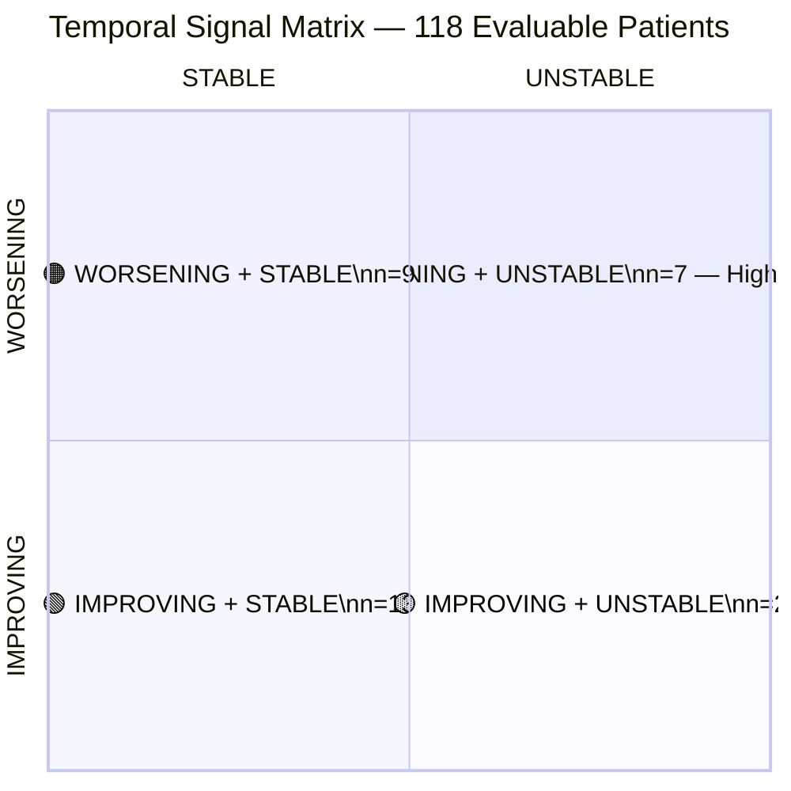

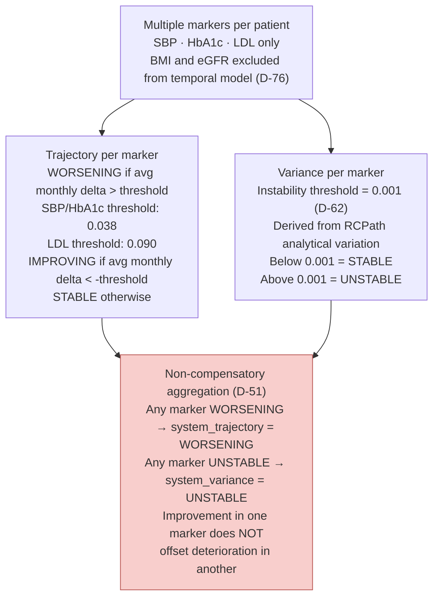

---

## 9. Priority String

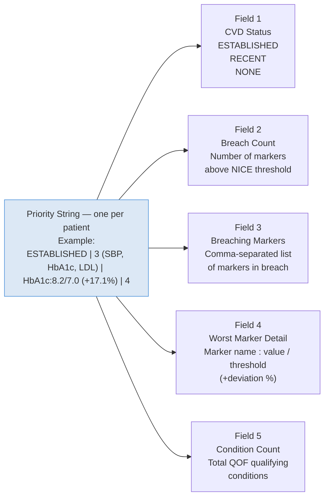

---

## 10. FHIR R4 Export Architecture

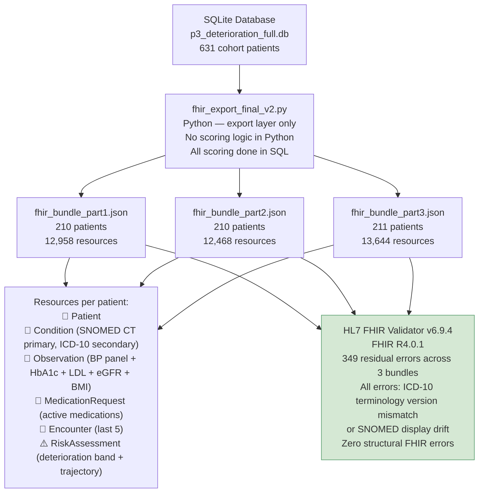

---

## 11. Validation Architecture

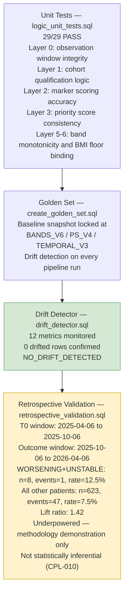

---

## 12. Technical Stack

| Layer | Tool | Purpose |
|-------|------|---------|
| Primary language | SQL (SQLite / DB Browser) | All cleaning, cohort preparation, scoring, validation |
| Data ingestion | Python (`load_data.py`) | Loading Synthea CSVs into SQLite |
| Terminology loading | Python (`load_snomed_map.py`) | Loading NHS Digital MonolithRF2 SNOMED→ICD-10 map |
| FHIR export | Python (`fhir_export_final_v2.py`) | Building FHIR R4 Bundle JSON from database |
| Visualisation | Tableau Public | Clinical dashboards |
| Patient explorer | HTML/JS (GitHub Pages) | Individual patient drill-down |
| Terminology | SNOMED CT (MonolithRF2 GB_20260311) | Condition coding |
| Terminology | ICD-10 5th Edition | Secondary condition coding |
| Terminology | LOINC | Observation coding |
| Terminology | RxNorm | Medication coding |
| Clinical standards | NICE NG136, NG28, NG238, NG203 | Exceedance thresholds |
| Clinical standards | KDIGO 2012 | eGFR staging |
| Clinical standards | NICE CG189 | BMI floor tiers |
| Clinical standards | RCPath | Analytical variation threshold (D-62) |
| FHIR standard | HL7 FHIR R4.0.1 | Interoperability export |
| Validation | HL7 FHIR Validator v6.9.4 | Structural FHIR compliance |

---

## 13. Clinical Problem Log — Summary

Ten design decisions documented with problem, decision, rationale, and limitation. Full entries in database table `clinical_problem_log`.

| Reference | Decision Type | Summary |
|-----------|--------------|---------|
| CPL-001 | Architecture | Synthea used — UCLH unavailable, MIMIC-IV requires credentialing |
| CPL-002 | Architecture | RTT design pivoted to deterioration monitoring — Synthea has no waiting list fields |
| CPL-003 | Clinical Rule | BMI floor rule — BMI excluded from dynamic exceedance argmax (D-79, NICE CG189) |
| CPL-004 | Clinical Rule | Acute SBP excluded — NICE NG136 specifies resting clinic BP (D-80) |
| CPL-005 | Clinical Rule | Variance threshold 0.001 — derived from RCPath analytical variation (D-62) |
| CPL-006 | Clinical Rule | Non-compensatory aggregation — any WORSENING/UNSTABLE marker fires system signal (D-51) |
| CPL-007 | Clinical Rule | Acute event scope — system detects metabolic deterioration, not plaque rupture |
| CPL-008 | Architecture | 361 patients DATA_INSUFFICIENT — flagged honestly, not imputed or dropped |
| CPL-009 | Clinical Rule | CKD-only excluded — no SBP/HbA1c/LDL scoring target without cardiometabolic comorbidity |
| CPL-010 | Validation | Retrospective validation underpowered (n=7) — methodology demonstration, not predictive evidence |

---

## 14. Information Governance

> **Version: v1.0 | Date: 2026-04-28**

### Caldicott Principles

This project was designed in compliance with the eight Caldicott Principles:

1. **Justify the purpose** — Cardiometabolic deterioration monitoring serves a defined clinical purpose: reducing unplanned emergency admission through earlier biomarker signal detection.
2. **Use only what is necessary** — Only five biomarkers (SBP, HbA1c, LDL, eGFR, BMI) are scored. No social, behavioural, or demographic data is used in clinical scoring.
3. **Access on a need-to-know basis** — In real deployment, access would be restricted to the clinical team responsible for the monitored patient cohort.
4. **Be aware of your responsibilities** — The builder is an MBBS graduate with clinical training. Clinical thresholds were applied with awareness of their guideline basis and limitations.
5. **Comply with the law** — No real patient data was used at any stage. All data is Synthea synthetic EHR.
6. **The duty to share can be as important as the duty to protect** — The FHIR R4 export layer is designed to enable safe, structured data sharing in a real deployment context.
7. **The primary purpose rule** — Data was used only for the stated purpose of building and validating the scoring pipeline.
8. **Do not be an obstacle to sharing** — The FHIR R4 export and GitHub Pages explorer are designed to make outputs accessible to clinical and informatics reviewers.

### DCB0129 Reference

DCB0129 (Clinical Risk Management: its Application in the Manufacture of Health IT Systems) applies to health IT systems intended for clinical use. This system is a proof-of-concept built on synthetic data and is not intended for clinical deployment. A real deployment would require a full DCB0129 clinical risk management file including hazard log, clinical risk assessment, and safety case report.

### DPIA Note

A Data Protection Impact Assessment (DPIA) would be required before any real deployment under UK GDPR Article 35. Key considerations would include: legal basis for processing, data minimisation review, access controls, retention policy, and patient notification obligations. No DPIA is required for this synthetic data project.

---

## 15. Known Limitations

| Limitation | Impact | Mitigation |
|------------|--------|------------|
| Synthea synthetic data — not real NHS EHR | Observation values procedurally generated, not clinically realistic | Explicitly framed as proof-of-concept throughout |
| 75.4% DATA_INSUFFICIENT temporal coverage | 361 of 479 scored patients have no trajectory signal | Synthea observation sparsity — real EMIS/SystmOne data would produce higher coverage |
| Retrospective validation underpowered (n=7) | No statistical inference possible | Methodology demonstrated — infrastructure is the evidence |
| Unit normalisation not applied | Synthea mixes mmol/L and mg/dL within same LOINC code | Thresholds calibrated to Synthea units — documented limitation |
| eGFR LOINC 33914-3 deprecated | CKD-EPI replacement (62238-1) not in Synthea | Retained with documentation — threshold values are equivalent |
| ICD-10 2019-covid-expanded version mismatch | 349 FHIR validator errors across 3 bundles | Terminology version constraint — not a structural FHIR error |
| RxNorm medication coding | UK deployment uses dm+d via TRUD | Synthea constraint — documented known limitation |

---

## 16. Patient Explorer

An interactive HTML patient explorer is available at:

**[GitHub Pages — Patient Explorer](https://asadqureshi12.github.io/cardiometabolic-deterioration/explorer/)**

Features:
- Search by patient ID with autocomplete
- Deterioration band badge coloured by data sufficiency
- Scoring pathway breakdown
- Priority string with field annotations
- Marker scores table (mean_i, data tier, trajectory, variance)
- Monthly exceedance chart (SBP, HbA1c, LDL)
- WORSENING+UNSTABLE alert banner

---

## 17. Disclaimer

This project uses Synthea-generated synthetic EHR data only. No real NHS patient data was used or accessed at any stage. All patient identifiers are synthetic UUIDs generated by the Synthea engine. This system is not validated for clinical use, has not undergone clinical risk assessment under DCB0129, and must not be used to make clinical decisions about real patients.

---

*Pipeline version: BANDS_V6 / PS_V4 / TEMPORAL_V3*
*Golden set: confirmed NO_DRIFT*
*FHIR validation: HL7 FHIR Validator v6.9.4, FHIR R4.0.1*
*Data: Synthea v3.x, 1,113-patient cohort*
*Terminology: NHS Digital TRUD MonolithRF2 GB_20260311*