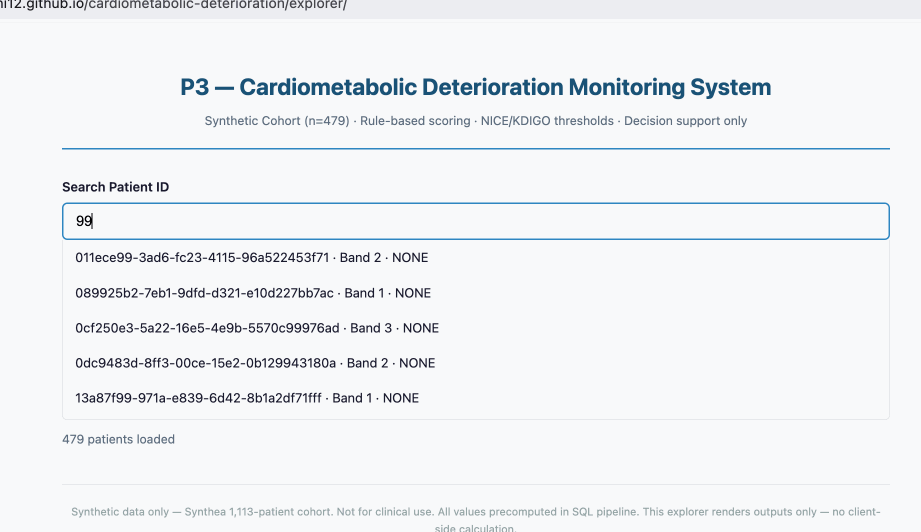
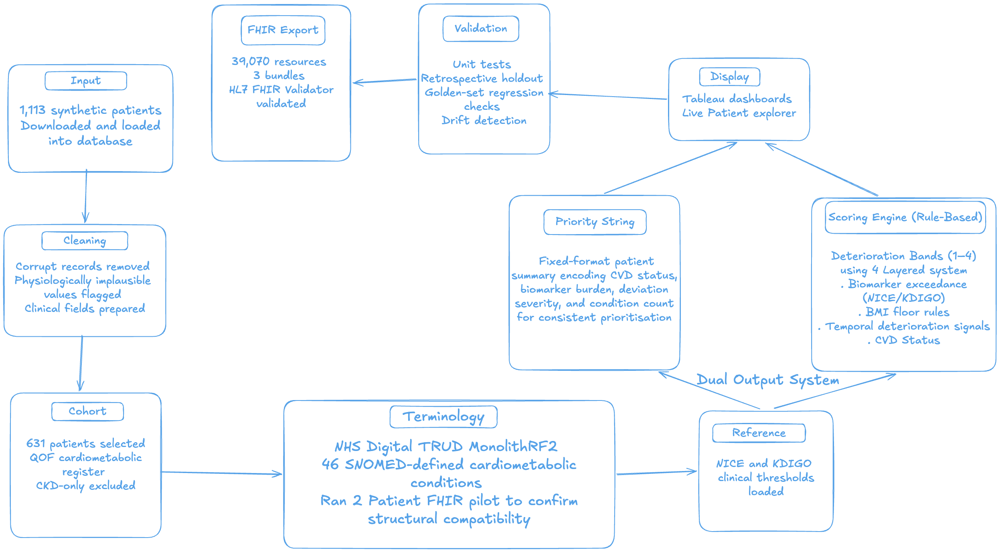
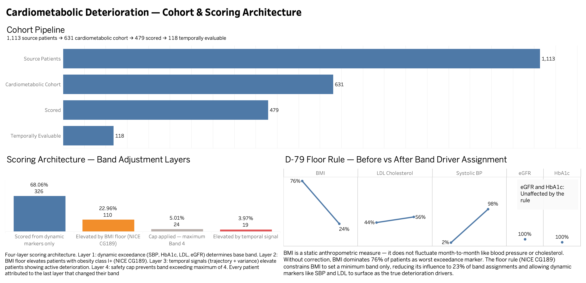
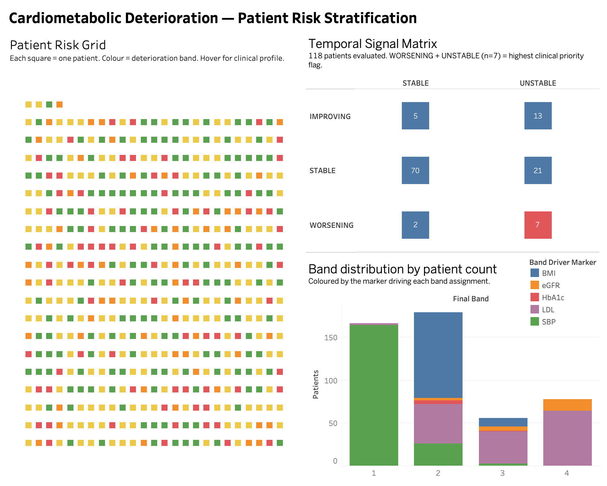

# Cardiometabolic Deterioration Monitoring System

## TL;DR

- Rule-based cardiometabolic deterioration monitoring system built in SQL with Python and FHIR export
- 631-patient QOF-derived chronic disease cohort constructed from Synthea 1,113-patient EHR
- Two parallel output layers: objective clinician-facing priority string and holistic band assignment
- 4-layer scoring architecture: threshold exceedance → BMI floor → temporal signals → clinical caps
- Flags patients with concurrent deterioration trajectory and instability across biomarker domains
- FHIR R4 export — 39,070 resources, zero structural errors, HL7 Validator v6.9.4
- Four complementary validation and consistency analyses
- No machine learning, probabilistic modelling, or predictive calibration
- All clinical reasoning in SQL — Python used for ingestion and FHIR export only


[](https://github.com/asadqureshi12/cardiometabolic-deterioration/actions/workflows/fhir-validation.yml)

---

## Key Findings

| Metric | Value |
|---|---|
| Source patients | 1,113 |
| QOF chronic disease cohort | 631 |
| Scored patients | 479 |
| Temporal signal computed | 118 |
| Highest-priority (WORSENING + UNSTABLE) | 7 |
| FHIR resources exported | 39,070 |
| Structural FHIR errors | 0 |
| Unit tests | 29 / 29 PASS |
| Drift status | NO_DRIFT_DETECTED |

---

## Live Demo

<p align="center">
  
</p>

<p align="center">
  <a href="https://asadqureshi12.github.io/cardiometabolic-deterioration/explorer/">Launch Patient Explorer →</a>
</p>

---

## 1. Clinical Context

Cardiometabolic disease — encompassing Type 2 diabetes, cardiovascular disease, hypertension, and chronic kidney disease — represents the highest burden of morbidity and hospitalisation in NHS secondary care. Deterioration in this population is characterised by gradual, simultaneous biomarker trajectory changes across multiple physiological domains. Standard clinical monitoring is episodic and reactive. This system demonstrates a proactive, longitudinal monitoring architecture that aggregates biomarker signals into a structured deterioration prioritisation output using a one-year observation window.

All clinical thresholds and escalation criteria are derived from NICE, KDIGO, RCPath, and QOF guidance. No thresholds were invented or calibrated to the dataset.

---

## 2. System Architecture & Cohort Pipeline

<p align="center">
  
</p>

| Stage | n |
|---|---|
| Source patients (Synthea) | 1,113 |
| QOF chronic disease cohort (CKD-only exclusion applied) | 631 |
| Scored (sufficient marker data) | 479 |
| Temporal signal computed (observation density threshold met) | 118 |
| WORSENING + UNSTABLE | 7 |

The attrition from 479 scored to 118 temporal reflects a deliberate design constraint: trajectory and variance signals require minimum longitudinal observation density across SBP, HbA1c, and LDL. Synthea under-populates outpatient observations relative to NHS EHR systems such as EMIS or SystmOne. In a real deployment, temporal coverage would be substantially higher.

---


## 3. Cohort Selection

<p align="center">
  
</p>

The cohort is constructed using 46 SNOMED codes identified from NHS England QOF clinical disease register condition groups and confirmed present in the Synthea dataset, verified against the NHS England Primary Care Domain refset (release 20260212). SNOMED codes were mapped to ICD-10 via NHS Digital TRUD ExtendedMap GB_20260311. Code selection was scoped to adult chronic conditions with at least one active cardiometabolic scoring pathway (SBP, HbA1c, LDL, BMI, or eGFR). Paediatric conditions (childhood asthma) and pre-diagnostic states (prediabetes) were excluded as they fall outside the NICE-defined threshold framework applied by the scoring engine. CKD without any qualifying cardiometabolic comorbidity is excluded — see CPL-009. CVD status (ESTABLISHED / RECENT / NONE) is assigned at cohort entry and determines which LDL threshold applies throughout scoring (NICE NG238). In a real NHS deployment, this cohort would correspond to patients on QOF chronic disease registers maintained by GP practices — in this synthetic data project, the equivalent population is constructed by code matching against Synthea condition data.

---

## 4. CVD Status Assignment

<p align="center">
  
</p>

CVD status is assigned at cohort entry and is fixed for the duration of scoring. Three states are possible: `RECENT` (STEMI or NSTEMI within 365 days — SNOMED 401303003 / 401314000 — Band floor 2 applied, LDL target 77.3 mg/dL per NICE NG238 post-ACS), `ESTABLISHED` (any CVD history: IHD, HF, AF, valve disease, MI/CABG — LDL target 77.3 mg/dL), `NONE` (no CVD history — LDL target 116.0 mg/dL). CVD status determines which LDL exceedance threshold is applied throughout all downstream scoring.

---

## 5. Data Sufficiency Tiers

Three sufficiency states were implemented. No imputation, interpolation, or synthetic trajectory reconstruction was performed.

| State | Criteria | Behaviour |
|---|---|---|
| `DATA_SUFFICIENT` | ≥2 observations across ≥3 months | Full temporal scoring enabled |
| `PARTIALLY_SUFFICIENT` | ≥2 observations across ≥2 months | Severity scoring only |
| `DATA_INSUFFICIENT` | Below minimum temporal criteria | Mean exceedance only — flagged explicitly |

Patients with sparse data remain flagged as `DATA_INSUFFICIENT` in band assignment and the patient explorer. The clinician sees the data gap, not an absence of risk.

---

## 6. Scoring Architecture — Two Output Layers

The system produces two parallel output layers. Band assignment incorporates temporal trajectory signals as one of four scoring layers — the layers are parallel in output but share temporal signal data.

### Layer 1 — Priority String (Objective)

A four-field structured string encoding the patient's physiological position:

CVD_STATUS | MARKERS_BREACHING | WORST_MARKER | CONDITION_COUNT

Each field maps directly to a computable, guideline-anchored value. No subjectivity — the string reports what the data shows.

### Layer 2 — Band Assignment (Holistic, Bands 1–4)

Integrates clinical severity, temporal trajectory, structural clinical concern, and data sufficiency into a single triage band. A prioritisation signal — not a clinical decision.

The separation of these two layers reflects the DCB0129 principle that clinical decision support tools must be transparent, auditable, and interpretable by the clinician using them.

### Why Rule-Based Instead of ML?

| Rule-Based | ML |
|---|---|
| Fully interpretable | Lower interpretability |
| Guideline-traceable | Dataset-dependent |
| Deterministic outputs | Probabilistic outputs |
| Easier DCB0129 auditability | Requires extensive real-world validation |
| Suitable for synthetic proof-of-concept | Requires real-world training data |

---

## 7. Band Distribution

Band assignment covers all 479 scored patients. Temporal scoring is a downstream step applied only to patients meeting observation density criteria — it does not gate band assignment.

| Band | n | Interpretation |
|---|---|---|
| 1 | 166 | Stable — no active exceedance |
| 2 | 179 | Emerging concern — monitoring indicated |
| 3 | 56 | Significant deterioration — clinical review |
| 4 | 78 | Highest-priority surveillance state |
| **Total** | **479** | |

Of the 118 temporal patients, 7 carry a WORSENING+UNSTABLE signal. All 7 sit in Band 4. Band assignment and temporal signal computation share no direct input data but are not fully independent — the band layer incorporates temporal signals as Layer 3 inputs. Convergence is partly architectural design and partly an empirical finding.

---

## 8. Temporal Signal Logic

Applied to **SBP, HbA1c, and LDL only**. BMI excluded (D-76/D-79 — floor mechanism only). eGFR modelled via KDIGO stage transitions. **118 patients** met temporal sufficiency criteria.

| Component | States | Basis |
|---|---|---|
| Trajectory | WORSENING / STABLE / IMPROVING | Marker-specific delta thresholds |
| Variance | UNSTABLE / STABLE | 0.001 — distributional analysis; RCPath CV corroborates noise floor |

**System-level aggregation is non-compensatory (D-51):** any marker WORSENING → system WORSENING; any marker UNSTABLE → system UNSTABLE. Improvements in one marker do not offset deterioration elsewhere. This is a clinical safety governance decision — severe compromise in one domain must not be masked by stability in another. Full threshold values and rationale in `docs/technical_report.md`.

| Group | Definition | n |
|---|---|---|
| **WORSENING + UNSTABLE** | Concurrent deterioration and instability | 7 |

---

## 9. Priority String

<p align="center">
  
</p>

### Annotated Example

ESTABLISHED | 3 | HbA1c:8.2/7.0 (+17.0%) | 4

| Field | Value | Meaning |
|---|---|---|
| CVD_STATUS | `ESTABLISHED` | Established CVD history — lower LDL threshold applies (77.3 mg/dL, NICE NG238) |
| MARKERS_BREACHING | `3` | 3 of 5 scored markers exceed their guideline threshold |
| WORST_MARKER | `HbA1c:8.2/7.0 (+17.0%)` | Highest exceedance marker — name, observed value, threshold, percentage deviation |
| CONDITION_COUNT | `4` | 4 active coded cardiometabolic conditions |

A clinician reading this string can immediately identify that this patient has established CVD, three markers above threshold, HbA1c as the most deviated marker at 17% above the NICE NG28 target, and a high comorbidity burden — without needing to interpret a composite score. Trajectory and variance signals are captured in the band assignment layer and surfaced separately in the patient explorer and Tableau dashboards.

---

## 10. Scoring Pipeline

| Marker | Guideline | Tier 0 | Tier 1 | Tier 2 | Tier 3 |
|---|---|---|---|---|---|
| Systolic BP | NICE NG136 | <140 mmHg | 140–159 | 160–179 | ≥180 |
| HbA1c | NICE NG28 | <7.0% | 7.0–8.4% | 8.5–9.9% | ≥10.0% |
| LDL (CVD+) | NICE NG238 | No breach | 0–25% excess | 25–50% excess | >50% excess |
| LDL (no CVD) | NICE NG238 | No breach | 0–25% excess | 25–50% excess | >50% excess |
| eGFR | KDIGO 2012 | ≥60 | 45–59 | 30–44 | <30 |
| BMI | NICE CG189 | <25 | 25–29.9 | 30–34.9 → Band 2 floor | ≥35 → Band 3 floor |

**Exceedance intensity formula:**
I = MAX(0, (x - T) / T)
Where `x` is the patient's observed mean value and `T` is the published guideline threshold. BMI operates as a minimum band floor only — not proportional exceedance (D-79, CPL-003).

---

## 11. Four Scoring Layers

<p align="center">
  
</p>

---

## 12. FHIR R4 Export

All 631 cohort patients exported as FHIR R4 bundles via `fhir_export_final_v2.py`. No scoring logic in Python — the script reads final SQLite outputs only. All clinical reasoning is in SQL. Each bundle contains: `Patient`, `Condition` (SNOMED CT + ICD-10), `Observation` (LOINC), `MedicationRequest` (RxNorm — CPL-011), `Encounter`, `RiskAssessment` (band and trajectory).

| Batch | Patients | Resources |
|---|---|---|
| Part 1 | 210 | 12,958 |
| Part 2 | 210 | 12,468 |
| Part 3 | 211 | 13,644 |
| **Total** | **631** | **39,070** |

Validated against HL7 FHIR Validator v6.9.4, R4.0.1 — zero structural errors. Residual warnings are terminology-related and reflect the synthetic data source. Validation is against base FHIR R4.0.1 only. NHS deployment requires FHIR UK Core R4 conformance, which imposes additional constraints not tested here — see CPL-011.

---

## 13. Validation

<p align="center">
  
</p>

Four complementary analyses applied. WORSENING+UNSTABLE group (n=7) does not reach n≥20 for statistical inference — this is retrospective observational enrichment analysis, not a performance benchmark (CPL-010).

**V1 — Retrospective Encounter Enrichment**

| Group | n | Acute encounters | Event rate |
|---|---|---|---|
| WORSENING + UNSTABLE | 7 | 0 | 0.0% |
| All other patients | 111 | 17 | 15.3% |

Inverse result — synthetic data limitation made quantitatively explicit. Synthea does not generate the clinical trajectories that precede real-world cardiometabolic acute admissions. Scoring rules remain internally consistent and guideline-anchored.

**V2 — Tier Convergence (strongest consistency finding)**

| Group | Band 1 | Band 2 | Band 3 | Band 4 |
|---|---|---|---|---|
| WORSENING + UNSTABLE | 0 | 0 | 0 | 7 |
| All other patients | 31 | 27 | 23 | 23 |

All 7 WORSENING+UNSTABLE patients in Band 4. Band assignment and temporal signal computation converge on the same patients. The two layers share no direct input data but are not fully independent — temporal signals feed into band assignment as Layer 3. Convergence is partly a structural consequence of the scoring architecture and partly an empirical finding.

**V3 — Internal Consistency Check:** WORSENING+UNSTABLE patients show 67% higher average exceedance intensity (0.1875 vs 0.1124). This confirms the scoring formula was applied correctly — mean exceedance intensity is the measure used to identify these patients, so higher intensity in the flagged group is an expected arithmetic consequence, not an independent validation finding. Higher maximum intensity in the unflagged group reflects single-marker extremity without trajectory — consistent with the multi-domain convergence requirement for Band 4.

**V4 — Monthly Slope:** WORSENING+UNSTABLE group trends upward 0.021 → 0.365 across the observation window. All other patients oscillate flatly 0.107–0.150 with no directional signal. Full monthly table in `docs/technical_report.md`.

---


## 14. Operational Considerations

**Observation density.** 74.5% of scored patients did not meet temporal threshold. EMIS and SystmOne chronic disease review pathways would produce substantially higher coverage. Observation density is the primary operational constraint — not the scoring architecture.

**EHR integration.** The SQL scoring architecture is EHR-agnostic. The integration layer would need to map local encounter classification, SNOMED coding, and LOINC observation codes to pipeline expectations.

**Clinician review capacity.** The system produces a prioritised patient list, not a care plan. Operational value depends on a defined clinical workflow for Band 3 and Band 4 patients — medication review, cardiology referral, or structured GP review.

**Coding quality.** Cohort eligibility depends on accurate SNOMED condition coding in the source EHR. A coding audit is a prerequisite for deployment.

---

## 15. Technical Stack

| Layer | Tool | Purpose |
|---|---|---|
| Primary language | SQL — SQLite / DB Browser | Cleaning, cohort, scoring, validation |
| Data ingestion | Python — load_data.py | Synthea CSVs into SQLite |
| Terminology loading | Python — load_snomed_map.py | MonolithRF2 SNOMED→ICD-10 |
| FHIR export | Python — fhir_export_final_v2.py | FHIR R4 Bundle JSON |
| Visualisation | Tableau Public | Clinical dashboards |
| Patient explorer | HTML/JS — GitHub Pages | Individual patient drill-down |
| Conditions | SNOMED CT MonolithRF2 GB_20260311 | Primary condition coding |
| Conditions | ICD-10 5th Edition | Secondary condition coding |
| Observations | LOINC | Biomarker coding |
| Medications | RxNorm | Medication coding (see CPL-011) |
| Thresholds | NICE NG136, NG28, NG238, CG189 | Exceedance thresholds |
| Thresholds | KDIGO 2012 | eGFR staging |
| Thresholds | RCPath | Variance threshold noise floor corroboration (D-62) |
| Interoperability | HL7 FHIR R4.0.1 | Export standard |

---

## 16. Repository Structure

```
cardiometabolic-deterioration/
├── /sql
│   ├── clean_data.sql
│   ├── load_reference.sql
│   ├── prepare_cohort.sql
│   ├── score_patients.sql
│   ├── validate_outputs.sql
│   ├── logic_unit_tests.sql
│   ├── create_golden_set.sql
│   └── drift_detector.sql
├── /python
│   ├── load_data.py
│   ├── load_snomed_map.py
│   └── fhir_export_final_v2.py
├── /fhir
│   ├── output_part1.json
│   ├── output_part2.json
│   └── output_part3.json
├── /screenshots
│   ├── dashboard1.png
│   ├── dashboard2.png
│   └── [excalidraw diagrams]
├── /explorer
│   └── index.html
└── /docs
    ├── sprint1_log.md
    ├── project_reference.md
    └── technical_report.md
```

## 17. Reproducibility

Pipeline is fully deterministic. All scoring constants stored in `scoring_constants` — no parameters hardcoded in SQL. Full execution order in `docs/technical_report.md`.

| Component | Locked version |
|---|---|
| Band assignment | BANDS_V6 |
| Priority scores | PS_V4 |
| Temporal signals | TEMPORAL_V3 |
| Drift status | NO_DRIFT_DETECTED |
| Unit tests | 29/29 PASS |
| FHIR validator | HL7 v6.9.4, R4.0.1 |
| SNOMED release | NHS Digital TRUD MonolithRF2 GB_20260311 |

Golden set tables (`golden_patient_bands`, `golden_priority_scores`, `golden_temporal_signals`) stored in database. `drift_detector.sql` compares any re-run against these — 12 metrics, zero drift permitted.

---


## 18. Clinical Problem Log — Summary

| Reference | Type | Summary |
|---|---|---|
| CPL-001 | Architecture | Synthea used — UCLH unavailable, MIMIC-IV requires credentialing |
| CPL-002 | Architecture | Original RTT design pivoted — Synthea has no waiting list fields. Cardiometabolic deterioration monitoring selected as replacement: higher NHS secondary care impact, directly applicable to NICE-anchored biomarker thresholds, and architecturally distinct from P2 |
| CPL-003 | Clinical Rule | BMI floor rule — excluded from dynamic argmax — D-79, NICE CG189 |
| CPL-004 | Clinical Rule | Acute SBP excluded — NICE NG136 resting BP only — D-80 |
| CPL-005 | Clinical Rule | Variance threshold 0.001 — empirical distribution analysis; RCPath CV corroborates noise floor — D-62 |
| CPL-006 | Clinical Rule | Non-compensatory aggregation — any signal fires system flag — D-51 |
| CPL-007 | Clinical Rule | Scope limited to metabolic deterioration — plaque rupture explicitly out of scope |
| CPL-008 | Architecture | 361 DATA_INSUFFICIENT — flagged honestly, not imputed |
| CPL-009 | Clinical Rule | CKD-only patients excluded — no cardiometabolic scoring target without HTN or DM |
| CPL-010 | Validation | Retrospective analysis underpowered (n=7) — four methods documented as methodology demonstration |
| CPL-011 | Architecture | RxNorm retained in FHIR export — Synthea generates no dm+d codes; NHS deployment requires dm+d VMP mapping per FHIR UK Core R4 profile |
| CPL-012 | Validation | BANDS_V1 and BANDS_V2 bug — 360 patients incorrectly UNSCORED due to conflation of tier computability and temporal evaluability. Corrected in BANDS_V3. Golden set locked at BANDS_V6 |

Full problem, decision, rationale, and limitation for each entry in `docs/technical_report.md`.

---

## 19. Information Governance

All data is Synthea-generated synthetic EHR — no real patient data was used or accessed at any stage. Full Caldicott eight-principle compliance table, DCB0129 hazard log, and DPIA scoping in `docs/technical_report.md`.

- **Caldicott Principles** — Only five scoring biomarkers processed. No social, behavioural, or unnecessary demographic data. Minimum necessary access principle applied to system design.
- **DCB0129** — Would apply to any real deployment. Non-compensatory aggregation, explicit DATA_INSUFFICIENT flagging, and two-layer output architecture were each designed with DCB0129 auditability in mind. Four design-stage hazards identified and controlled.
- **DPIA** — Required under UK GDPR Article 35 before real deployment. Not required for this synthetic data project. Legal basis, data minimisation, access controls, and patient notification obligations scoped in technical report.

---

## 20. Known Limitations

| Limitation | Impact | Status |
|---|---|---|
| Synthea synthetic data | V1 retrospective result inverse — expected | Proof-of-concept throughout; rules guideline-anchored, not dataset-calibrated |
| 75.4% DATA_INSUFFICIENT for temporal scoring | 361 patients have no trajectory signal | Synthea sparsity — real EHR coverage substantially higher |
| Retrospective analysis underpowered (n=7) | No statistical inference possible | Four-method pipeline — methodology infrastructure, not benchmark |
| Unit normalisation not applied | Mixed units within LOINC code possible | Thresholds calibrated to Synthea conventions — documented |
| eGFR LOINC 33914-3 deprecated | CKD-EPI replacement not in Synthea | Retained with documentation — no scoring impact |
| RxNorm medication coding | Not valid for NHS interoperability | dm+d mapping identified as deployment prerequisite — CPL-011 |
| 4 DATA_INSUFFICIENT rows — mean_i discrepancy (D-81) | Minor inconsistency | No downstream impact — marker_scores.mean_i is source of truth |
| Deprivation scoring not implemented | Formula defined, not applied to scoring output | Locked as future scope — formula and rationale in project_reference |
| 152 cohort patients produce no scoring output | 24.1% of clinically eligible patients have no observable data in the 12-month window | Synthea data sparsity — explicitly modelled as data absence, not exclusion. Real EHR data would produce substantially lower unscored proportion. |
|  5 of 46 cohort SNOMED codes not in NHS England PCD refset | Codes for hyperlipidaemia (55822004), hypertriglyceridaemia (302870006), seizure disorder (128613002), neoplasm of prostate (126906006), and carcinoma in situ of prostate (92691004) are absent from PCD refset release 20260212 | Absence confirmed by exhaustive search of the refset — no alternative codes or aliases found for any of the 5 concepts. QOF does not maintain a standalone hyperlipidaemia or hypertriglyceridaemia register; only familial hypercholesterolaemia specific codes are present. The epilepsy cluster uses epilepsy-specific SNOMED codes; seizure disorder (128613002) is not included. The cancer register uses confirmed malignancy only (399068003); neoplasm of prostate is a broader term and carcinoma in situ is pre-invasive and intentionally excluded from QOF. These codes predate the project's citable-reference principle — the cohort was constructed before that principle was formalised. Re-running cohort selection was assessed as low priority: all 5 are clinically legitimate conditions present in Synthea data and all affected patients produce no exceedance signal (Band 1, no cardiometabolic markers). This is a documented process drift, not a clinical judgement decision. Impact on scoring outputs: nil. |
| 15 scored patients have no cardiometabolic qualifying condition | Patients with only epilepsy or seizure disorder codes entered the cohort through QOF neurological register codes and were scored | All 15 are Band 1 — no exceedance signal without cardiometabolic markers. No clinical impact on scoring outputs. Confirmed by SQL. |

---

## 21. Patient Explorer

**[Launch Patient Explorer →](https://asadqureshi12.github.io/cardiometabolic-deterioration/explorer/)**

Search by patient ID — view deterioration band, priority string, marker scores, monthly exceedance chart, and WORSENING+UNSTABLE alert.

---

## 22. Tableau Dashboards

**[Dashboard 1 — Population Overview](https://public.tableau.com/app/profile/33e422.prorton/viz/Cardiometabolic_Deterioration_Monitoring/Dashboard1)**

**[Dashboard 2 — Temporal Signals](https://public.tableau.com/app/profile/33e422.prorton/viz/Cardiometabolic_Deterioration_Monitoring/Dashboard2)**

<p align="center">
  
</p>

<p align="center">
  
</p>

---

## 23. Disclaimer

Synthea-generated synthetic EHR data only. No real NHS patient data was used or accessed at any stage. All identifiers are synthetic UUIDs. No machine learning, probabilistic modelling, or predictive calibration was performed. This system has not been validated for clinical use and has not been assessed under DCB0129. It must not be used for clinical decisions about real patients.

---

*Pipeline: BANDS_V6 / PS_V4 / TEMPORAL_V3 — NO_DRIFT_DETECTED*
*FHIR: HL7 Validator v6.9.4, R4.0.1*
*Terminology: NHS Digital TRUD MonolithRF2 GB_20260311*
*Data: Synthea 1,113-patient cohort*
