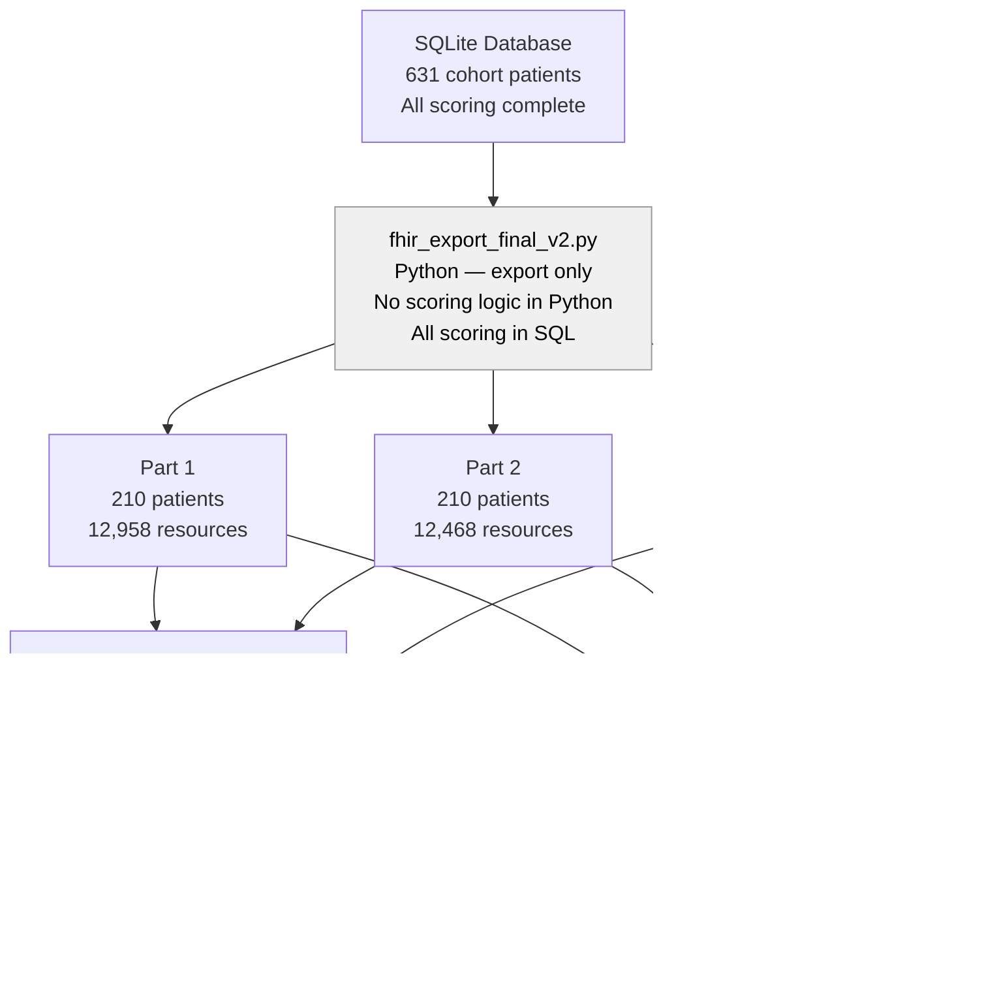
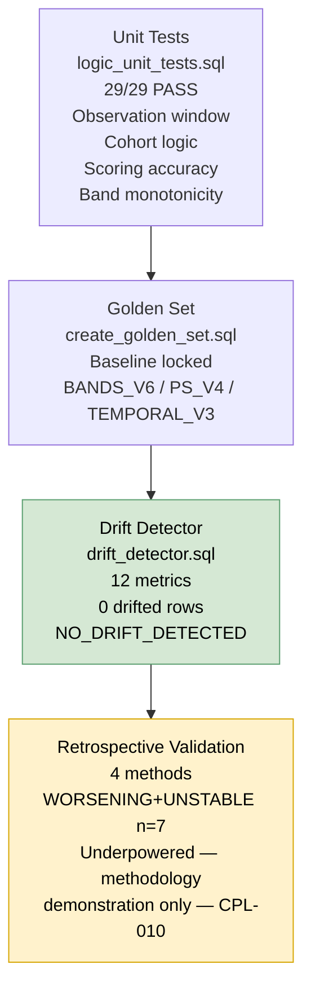

Where `x` is the patient's observed mean value and `T` is the published guideline threshold. This produces a normalised exceedance intensity anchored to the threshold, not to the dataset distribution. Two patients can cross the same threshold but receive different scores if their absolute exceedance differs. Intensity feeds directly into the WORST_SEVERITY field of the priority string and into band escalation logic via non-compensatory aggregation.

---

## 10a. Four Scoring Layers

  

---

## 11. FHIR R4 Export Architecture

```mermaid
flowchart TD
    DB["SQLite Database\n631 cohort patients\nAll scoring complete"]

    PY["fhir_export_final_v2.py\nPython — export only\nNo scoring logic in Python\nAll scoring in SQL"]

    B1["Part 1\n210 patients\n12,958 resources"]
    B2["Part 2\n210 patients\n12,468 resources"]
    B3["Part 3\n211 patients\n13,644 resources"]

    RES["Resources per patient\nPatient\nCondition — SNOMED + ICD-10\nObservation — BP panel + markers\nMedicationRequest\nEncounter\nRiskAssessment — band + trajectory"]

    VAL["HL7 FHIR Validator v6.9.4\nFHIR R4.0.1\nTerminology-related warnings only\nNo structural FHIR errors"]

    DB --> PY
    PY --> B1 & B2 & B3
    B1 & B2 & B3 --> RES
    B1 & B2 & B3 --> VAL

    style VAL fill:#d5e8d4,stroke:#5a9e6f,color:#000000
    style PY fill:#f0f0f0,stroke:#999,color:#000000
```

---

## 12. Validation Approach

Four independent validation methods were applied. Given the WORSENING+UNSTABLE group contains 7 patients (CPL-010), no method achieves the n≥20 threshold required for directional statistical inference. The validation pipeline is documented as methodology infrastructure — demonstrating that the system is designed to be testable — not as predictive performance evidence.

```mermaid
flowchart TD
    U["Unit Tests\nlogic_unit_tests.sql\n29/29 PASS\nObservation window\nCohort logic\nScoring accuracy\nBand monotonicity"]

    G["Golden Set\ncreate_golden_set.sql\nBaseline locked\nBANDS_V6 / PS_V4 / TEMPORAL_V3"]

    D["Drift Detector\ndrift_detector.sql\n12 metrics\n0 drifted rows\nNO_DRIFT_DETECTED"]

    R["Retrospective Validation\n4 methods\nWORSENING+UNSTABLE n=7\nUnderpowered — methodology\ndemonstration only — CPL-010"]

    U --> G --> D --> R

    style D fill:#d5e8d4,stroke:#5a9e6f,color:#000000
    style R fill:#fff2cc,stroke:#d6a500,color:#000000
```

### V1 — Retrospective Acute Encounter Rate

WORSENING+UNSTABLE patients were compared against all other temporal patients for acute or inpatient encounter rate in the 6 months following the observation window close date.

| Group | n | Acute encounters | Event rate |
|---|---|---|---|
| WORSENING + UNSTABLE | 7 | 0 | 0.0% |
| All other patients | 111 | 17 | 15.3% |

The inverse result — flagged patients showing lower acute encounter rates than the unflagged group — is the synthetic data limitation made quantitatively explicit. Synthea does not generate the clinical trajectories that precede real-world acute admissions in cardiometabolic populations. This result does not indicate a scoring system failure; it indicates that Synthea's observation generation does not reproduce the physiological patterns that the scoring rules were designed to detect. All clinical thresholds are anchored to published guidelines. The rules are correct. The synthetic population does not exhibit the conditions those rules are designed to identify.

### V2 — Tier Convergence (Internal Consistency)

WORSENING+UNSTABLE patients were cross-tabulated against band assignment to test whether two independent scoring layers converge on the same patients.

| Group | Band 1 | Band 2 | Band 3 | Band 4 |
|---|---|---|---|---|
| WORSENING + UNSTABLE | 0 | 0 | 0 | 7 |
| All other patients | 31 | 27 | 23 | 23 |

All 7 WORSENING+UNSTABLE patients sit in Band 4. Zero are in Bands 1–3. The band system and the temporal signal system were computed through entirely independent scoring pathways. Their convergence on the same seven patients is the strongest validation finding in the set — it demonstrates internal consistency across two layers that share no scoring logic.

### V3 — Delta Mean Exceedance Intensity

Average exceedance intensity (mean_i) was compared between groups to test whether flagged patients show higher absolute deviation from guideline thresholds.

| Group | n | Average mean_i | Min | Max |
|---|---|---|---|---|
| WORSENING + UNSTABLE | 7 | 0.1875 | 0.000 | 0.902 |
| All other patients | 111 | 0.1124 | 0.000 | 2.146 |

WORSENING+UNSTABLE patients show 67% higher average exceedance intensity. The direction is consistent with the band convergence finding. The higher maximum in the all-other-patients group reflects individual outlier patients with extreme single-marker exceedance without concurrent trajectory deterioration — consistent with the system's design, which requires multi-domain signal convergence, not single-marker extremity, for the highest-risk designation.

### V4 — Monthly Slope Analysis

Monthly mean_i was tracked across the observation window for both groups to test whether flagged patients show a directional upward trend versus the unflagged group.

| Month | WORSENING+UNSTABLE avg mean_i | All other patients avg mean_i |
|---|---|---|
| 2025-04 | 0.021 | 0.140 |
| 2025-05 | 0.276 | 0.117 |
| 2025-06 | 0.062 | 0.118 |
| 2025-07 | 0.149 | 0.125 |
| 2025-08 | 0.220 | 0.128 |
| 2025-09 | 0.155 | 0.141 |
| 2025-10 | 0.225 | 0.140 |
| 2025-11 | 0.191 | 0.107 |
| 2025-12 | 0.212 | 0.135 |
| 2026-01 | 0.309 | 0.149 |
| 2026-02 | 0.318 | 0.128 |
| 2026-03 | 0.365 | 0.126 |

The WORSENING+UNSTABLE group shows a clear upward trajectory from 0.021 in April 2025 to 0.365 in March 2026. The all-other-patients group oscillates flatly between 0.107 and 0.150 with no directional trend across the same period. This is the temporal signal behaving as designed — identifying patients whose exceedance intensity is genuinely and persistently increasing over time, not episodically elevated.

---

## 13. Financial Implications

This section presents an indicative financial impact estimate for illustrative purposes. It is not a prospective cost model and does not claim predictive validity for this synthetic cohort.

The NHS National Cost Collection 2022/23 records an average reference cost of approximately £2,500–£3,000 per unplanned medical admission spell. The retrospective validation (V1) identified an acute or inpatient encounter rate of 15.3% in the non-flagged temporal cohort over a 6-month window. In a real-world cardiometabolic monitoring deployment, the clinical value of a system such as this would derive from identifying patients in the WORSENING+UNSTABLE state early enough to enable community-level intervention — a medication review, a GP escalation, a community cardiology referral — before an unplanned admission occurs.

If a deployed system of equivalent architecture were applied to an NHS population of 1,000 cardiometabolic patients, and if the WORSENING+UNSTABLE prevalence matched the synthetic cohort rate of approximately 1.1% (7 of 631), approximately 11 patients would be flagged per cycle. If early escalation for flagged patients avoided one in four predicted admissions — a conservative assumption relative to published proactive care intervention studies — the avoided cost per monitoring cycle would be in the range of £6,875–£8,250 per 1,000 patients.

At Trust level, with a typical cardiology and diabetes outpatient register in the range of 5,000–15,000 patients, the operational case for a system of this kind is not marginal. The material constraint is not the scoring architecture — it is the observation density available in the source EHR, which determines how many patients can receive temporal scoring in the first place.

The deprivation scoring component (formula: `11 - deprivation_decile`), designed to weight population health risk alongside clinical risk, was documented as a design decision but not implemented in the current scoring pipeline. Integration of deprivation weighting in a future iteration would align the system with NHS Core20PLUS5 and NHSE health inequalities frameworks, and would strengthen the population health business case.

---

## 14. Technical Stack

| Layer | Tool | Purpose |
|-------|------|---------|
| Primary language | SQL — SQLite / DB Browser | Cleaning, cohort, scoring, validation |
| Data ingestion | Python — load_data.py | Synthea CSVs into SQLite |
| Terminology loading | Python — load_snomed_map.py | MonolithRF2 SNOMED→ICD-10 |
| FHIR export | Python — fhir_export_final_v2.py | FHIR R4 Bundle JSON |
| Visualisation | Tableau Public | Clinical dashboards |
| Patient explorer | HTML/JS — GitHub Pages | Individual patient drill-down |
| Conditions | SNOMED CT MonolithRF2 GB_20260311 | Primary condition coding |
| Conditions | ICD-10 5th Edition | Secondary condition coding |
| Observations | LOINC | Biomarker coding |
| Medications | RxNorm | Medication coding |
| Thresholds | NICE NG136, NG28, NG238, NG203, CG189 | Exceedance thresholds |
| Thresholds | KDIGO 2012 | eGFR staging |
| Thresholds | RCPath | Variance threshold (D-62) |
| Interoperability | HL7 FHIR R4.0.1 | Export standard |

---

## 15. Clinical Problem Log — Summary

| Reference | Type | Summary |
|-----------|------|---------|
| CPL-001 | Architecture | Synthea used — UCLH unavailable, MIMIC-IV requires credentialing |
| CPL-002 | Architecture | RTT design pivoted — Synthea has no waiting list fields |
| CPL-003 | Clinical Rule | BMI floor rule — excluded from dynamic argmax — D-79, NICE CG189 |
| CPL-004 | Clinical Rule | Acute SBP excluded — NICE NG136 resting BP only — D-80 |
| CPL-005 | Clinical Rule | Variance threshold 0.001 — RCPath analytical variation — D-62 |
| CPL-006 | Clinical Rule | Non-compensatory aggregation — any signal fires system flag — D-51 |
| CPL-007 | Clinical Rule | Acute event scope limited to metabolic deterioration — plaque rupture explicitly out of scope |
| CPL-008 | Architecture | 361 DATA_INSUFFICIENT — flagged honestly, not imputed |
| CPL-009 | Clinical Rule | CKD-only patients excluded — no cardiometabolic scoring target without HTN or DM |
| CPL-010 | Validation | Retrospective validation underpowered (n=7) — four methods documented as methodology demonstration |

---

## 16. Information Governance

### Caldicott Principles

This project was designed in compliance with the Caldicott Principles. Only the five scoring biomarkers are used — no social, behavioural, or unnecessary demographic data is processed. In real deployment, access would be restricted to the responsible clinical team with a defined minimum necessary access policy. All data used in this project is Synthea synthetic EHR — no real patient data was used or accessed at any stage. The FHIR R4 export layer is designed to enable safe, structured data sharing in a real deployment context. Data was used only for the stated purpose of building and validating the scoring pipeline.

### DCB0129

DCB0129 (Clinical Risk Management in Health IT) would apply to any real deployment of this system. This proof-of-concept would require a full clinical risk management file — including a hazard log, clinical risk assessment, and safety case report — before operational use. The non-compensatory aggregation design, the explicit DATA_INSUFFICIENT flagging, and the two-layer output architecture were each made with DCB0129 auditability in mind.

### DPIA

A Data Protection Impact Assessment would be required under UK GDPR Article 35 before real deployment. Key considerations would include: legal basis for processing, data minimisation, access controls, retention policy, and patient notification obligations. No DPIA is required for this synthetic data project.

---

## 17. Known Limitations

| Limitation | Impact | Mitigation |
|------------|--------|------------|
| Synthea synthetic data | Observations procedurally generated — does not reproduce NHS clinical complexity | Explicitly proof-of-concept throughout; scoring rules anchored to published guidelines, not dataset |
| 75.4% DATA_INSUFFICIENT for temporal scoring | 361 patients have no trajectory signal | Synthea observation sparsity — real EMIS/SystmOne data would produce substantially higher temporal coverage |
| Retrospective validation underpowered | n=7 WORSENING+UNSTABLE — no statistical inference possible | Four-method validation pipeline documented as methodology infrastructure, not performance benchmark |
| Unit normalisation not applied | Mixed units within same LOINC code possible | Thresholds calibrated to Synthea unit conventions — documented limitation |
| eGFR LOINC 33914-3 deprecated | CKD-EPI replacement LOINC not present in Synthea | Retained with documentation |
| RxNorm medication coding | UK deployment uses dm+d | Synthea constraint — documented; dm+d mapping identified as deployment prerequisite |
| Deprivation scoring not implemented | Population health weighting absent from current scoring | Documented design decision — formula locked (11 − deprivation_decile) — future scope |
| 4 DATA_INSUFFICIENT rows show mean_i discrepancy between marker_scores and monthly_i_scores | Minor inconsistency (D-81) | No downstream impact — breach detection uses marker_scores.mean_i as single source of truth — inconsistency preserved for reproducibility |

---

## 18. Patient Explorer

Interactive patient drill-down — search by ID, view band, trajectory, variance, and marker scores.

**[Launch Patient Explorer](https://asadqureshi12.github.io/cardiometabolic-deterioration/explorer/)**

Features:
- Search by patient ID with autocomplete
- Deterioration band badge coloured by data sufficiency
- Scoring pathway breakdown
- Priority string with field annotations
- Marker scores table
- Monthly exceedance chart (SBP, HbA1c, LDL)
- WORSENING+UNSTABLE alert banner

---

## 19. Tableau Dashboards

**[Dashboard 1 — Population Overview](https://public.tableau.com/app/profile/33e422.prorton/viz/Cardiometabolic_Deterioration_Monitoring/Dashboard1)**

**[Dashboard 2 — Temporal Signals](https://public.tableau.com/app/profile/33e422.prorton/viz/Cardiometabolic_Deterioration_Monitoring/Dashboard2)**

  

  

---

## 20. Disclaimer

Synthea-generated synthetic EHR data only. No real NHS patient data was used or accessed at any stage. All identifiers are synthetic UUIDs. This system has not been validated for clinical use and has not been assessed under DCB0129. It must not be used for clinical decisions about real patients.

---

*Pipeline: BANDS_V6 / PS_V4 / TEMPORAL_V3 — NO_DRIFT confirmed*
*FHIR: HL7 Validator v6.9.4, R4.0.1*
*Terminology: NHS Digital TRUD MonolithRF2 GB_20260311*
*Data: Synthea 1,113-patient cohort*
