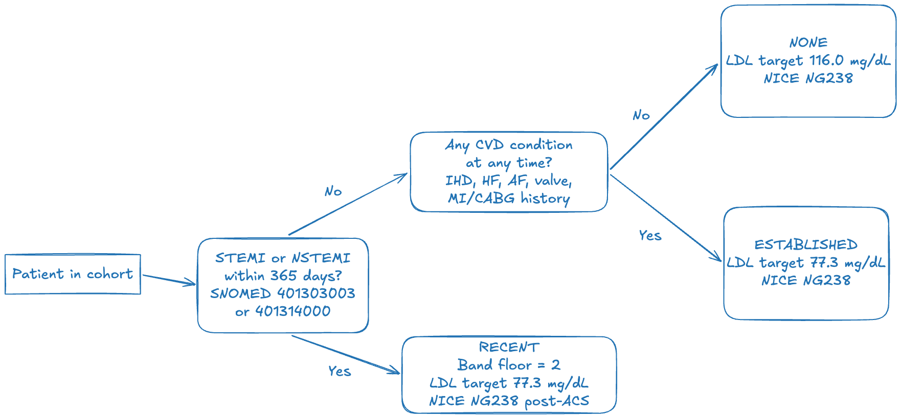
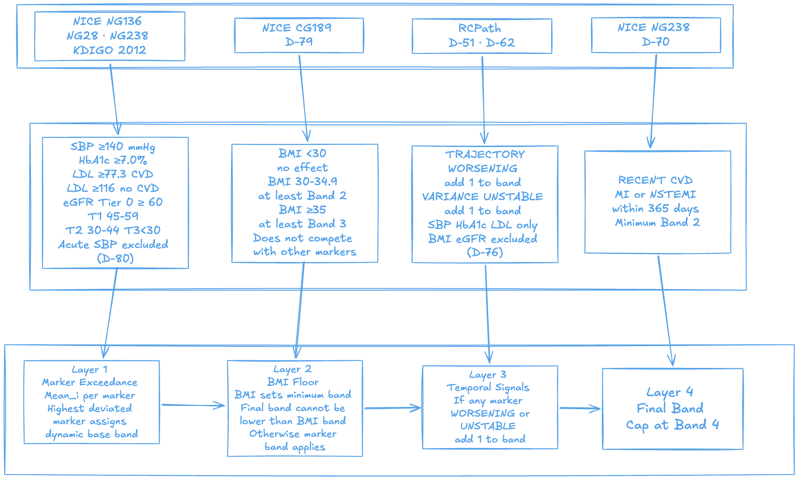
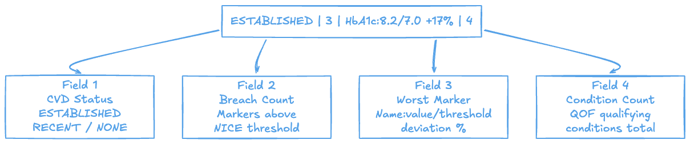
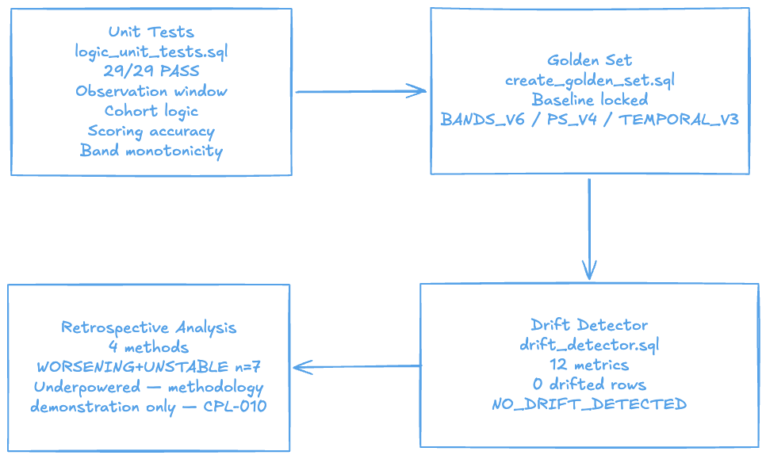
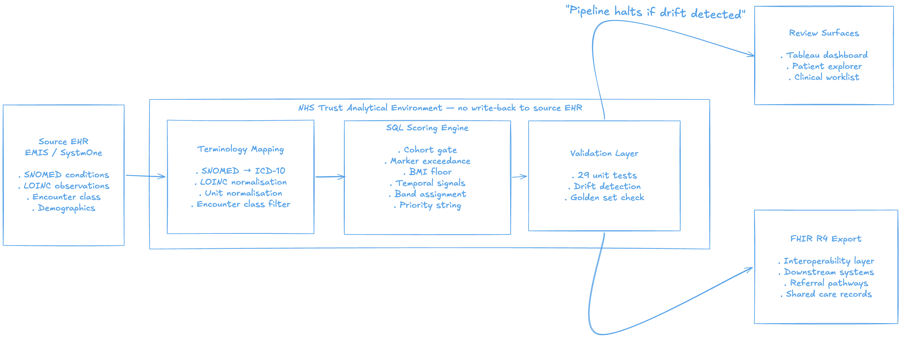

# Clinical Safety and Validation
## Cardiometabolic Deterioration Monitoring System — P3

*This document contains extended technical and governance detail supplementing the main README.
All clinical outputs, scoring versions, and validation results are as locked in the main README.*

---

## 0. System Architecture & Technical Reference

  

### 0.1 Cohort Selection

The cohort is constructed using 46 SNOMED codes identified from NHS England QOF clinical disease register condition groups and confirmed present in the Synthea dataset, verified against the NHS England Primary Care Domain refset (release 20260212). 41 of 46 codes confirmed in the refset. 5 codes were not found under any alternative code or alias — see Section 4 known limitations. SNOMED codes were mapped to ICD-10 via NHS Digital TRUD ExtendedMap GB_20260311. Paediatric conditions (childhood asthma) and pre-diagnostic states (prediabetes) excluded. CKD without qualifying cardiometabolic comorbidity excluded — CPL-009. CVD status (ESTABLISHED / RECENT / NONE) assigned at cohort entry and determines LDL threshold throughout scoring.

### 0.2 CVD Status Assignment

  

Three states: `RECENT` (STEMI or NSTEMI within 365 days — SNOMED 401303003 / 401314000 — Band floor 2 applied, LDL target 2.0 mmol/L / 77.3 mg/dL per NICE NG238 post-ACS), `ESTABLISHED` (any CVD history: IHD, HF, AF, valve disease, MI/CABG — LDL target 2.0 mmol/L / 77.3 mg/dL), `NONE` (no CVD history — LDL target 3.0 mmol/L / 116.0 mg/dL). LDL targets stated in mg/dL for display only — all scoring computations performed in mmol/L via deterministic conversion (mmol/L × 38.67).

### 0.3 Data Sufficiency Tiers

| State | Criteria | Behaviour |
|---|---|---|
| `DATA_SUFFICIENT` | ≥2 observations across ≥3 months | Full temporal scoring enabled |
| `PARTIALLY_SUFFICIENT` | ≥2 observations across ≥2 months | Severity scoring only |
| `DATA_INSUFFICIENT` | Below minimum temporal criteria | Mean exceedance only — flagged explicitly |

All sufficiency thresholds evaluated within the fixed 52-week observation window defined in scoring_constants (window_start → window_end).

### 0.4 Scoring Pipeline

  

| Marker | Guideline | Tier 0 | Tier 1 | Tier 2 | Tier 3 |
|---|---|---|---|---|---|
| Systolic BP | NICE NG136 | <140 mmHg | 140–159 | 160–179 | ≥180 |
| HbA1c | NICE NG28 | <7.0% | 7.0–8.4% | 8.5–9.9% | ≥10.0% |
| LDL (CVD+) | NICE NG238 — threshold 2.0 mmol/L | No breach | 0–25% excess | 25–50% excess | >50% excess |
| LDL (no CVD) | NICE NG238 — threshold 3.0 mmol/L | No breach | 0–25% excess | 25–50% excess | >50% excess |
| eGFR | KDIGO 2012 | ≥60 | 45–59 | 30–44 | <30 |
| BMI | NICE CG189 | <25 | 25–29.9 | 30–34.9 → Band 2 floor | ≥35 → Band 3 floor |

**Exceedance intensity formula:**
I = MAX(0, (x - T) / T)
Where `x` is the patient's observed mean value and `T` is the published guideline threshold. BMI operates as a static risk floor variable (non-temporal, non-exceedance, band modifier only) — not proportional exceedance (D-79, CPL-003).

### 0.5 Band Distribution

| Band | n | Interpretation |
|---|---|---|
| 1 | 166 | Stable — no active exceedance |
| 2 | 179 | Emerging concern — monitoring indicated |
| 3 | 56 | Significant deterioration — clinical review |
| 4 | 78 | Highest escalation band within the scoring framework |
| **Total** | **479** | |

Band assignment and temporal signal computation are generated through separate scoring pathways, although temporal outputs are incorporated into Layer 3 of band assignment.

### 0.6 Priority String — Annotated Example

  

`ESTABLISHED | 3 | HbA1c:8.2/7.0 (+17.0%) | 4`

| Field | Value | Meaning |
|---|---|---|
| CVD_STATUS | `ESTABLISHED` | Established CVD history — lower LDL threshold applies (2.0 mmol/L / 77.3 mg/dL, NICE NG238) |
| MARKERS_BREACHING | `3` | 3 of 5 scored markers exceed their guideline threshold |
| WORST_MARKER | `HbA1c:8.2/7.0 (+17.0%)` | Highest exceedance marker — name, observed value, threshold, percentage deviation |
| CONDITION_COUNT | `4` | 4 active coded cardiometabolic conditions |

### 0.7 FHIR R4 Export

All 631 cohort patients exported as FHIR R4 bundles via `fhir_export_final_v2.py`. No scoring logic in Python — script reads final SQLite outputs only. Each bundle contains: `Patient`, `Condition` (SNOMED CT + ICD-10), `Observation` (LOINC), `MedicationRequest` (RxNorm — CPL-011), `Encounter`, `RiskAssessment` (band and trajectory).

| Batch | Patients | Resources |
|---|---|---|
| Part 1 | 210 | 12,958 |
| Part 2 | 210 | 12,468 |
| Part 3 | 211 | 13,644 |
| **Total** | **631** | **39,070** |

Validated against HL7 FHIR Validator v6.9.4, R4.0.1 — zero structural errors. Validation is against base FHIR R4.0.1 only — not UK Core conformant. See CPL-011.

### 0.8 Validation Results

  

Four internal consistency and retrospective exploratory analyses applied. WORSENING+UNSTABLE group (n=7) does not reach n≥20 for statistical inference — not a performance benchmark (CPL-010).

**V1 — Retrospective Encounter Enrichment**

Included to test whether synthetic encounter generation exhibited any directional enrichment signal relative to deterioration status.

| Group | n | Acute encounters | Event rate |
|---|---|---|---|
| WORSENING + UNSTABLE | 7 | 0 | 0.0% |
| All other patients | 111 | 17 | 15.3% |

Inverse result — Synthea does not generate clinical trajectories preceding real-world cardiometabolic acute admissions. This is a dataset-behaviour finding, not a predictive validation failure.

**V2 — Tier Convergence**

| Group | Band 1 | Band 2 | Band 3 | Band 4 |
|---|---|---|---|---|
| WORSENING + UNSTABLE | 0 | 0 | 0 | 7 |
| All other patients | 31 | 27 | 23 | 23 |

All 7 WORSENING+UNSTABLE patients in Band 4. Convergence is partly a structural consequence of the scoring architecture and partly an empirical finding.

**V3 — Internal Consistency Check**

WORSENING+UNSTABLE patients show 67% higher average exceedance intensity (0.1875 vs 0.1124). This confirms the scoring formula was applied correctly — mean exceedance intensity is the measure used to identify these patients, so higher intensity in the flagged group is an expected arithmetic consequence, not an independent validation finding.

**V4 — Monthly Slope**

WORSENING+UNSTABLE group trends upward 0.021 → 0.365 across the observation window. All other patients oscillate flatly 0.107–0.150. Full monthly table in Section 5.

### 0.9 Technical Stack

| Layer | Tool | Purpose |
|---|---|---|
| Primary language | SQL — SQLite / DB Browser | Cleaning, cohort, scoring, validation |
| Data ingestion | Python — load_data.py | Synthea CSVs into SQLite |
| Terminology loading | Python — load_snomed_map.py | MonolithRF2 SNOMED→ICD-10 |
| FHIR export | Python — fhir_export_final_v2.py | FHIR R4 Bundle JSON |
| Visualisation | Tableau Public | Clinical dashboards |
| Patient explorer | HTML/JS — GitHub Pages | Individual patient drill-down |
| Conditions | SNOMED CT MonolithRF2 GB_20260311 | Primary condition coding |
| Conditions | ICD-10 5th Edition | Secondary condition coding |
| Observations | LOINC | Biomarker coding |
| Medications | RxNorm | Medication coding (see CPL-011) |
| Thresholds | NICE NG136, NG28, NG238, CG189 | Exceedance thresholds |
| Thresholds | KDIGO 2012 | eGFR staging |
| Thresholds | RCPath | Variance threshold noise floor corroboration (D-62) |
| Interoperability | HL7 FHIR R4.0.1 | Export standard |

---

## 1. Information Governance

### 1.1 Caldicott Principles

The system design was assessed against all eight Caldicott Principles. The table below documents compliance position for both the current synthetic proof-of-concept and the intended real-deployment architecture.

| Principle | Statement | Compliance Position |
|---|---|---|
| 1 | Justify the purpose | The stated purpose is identification of patients on QOF chronic disease registers at risk of cardiometabolic deterioration, for proactive clinical review. Cardiometabolic scoring applies to patients with qualifying conditions — patients without cardiometabolic conditions produce no signal and require no clinical action. Purpose is defined, bounded, and clinically justified. |
| 2 | Use confidential information only if necessary | Only five biomarkers (SBP, HbA1c, LDL, BMI, eGFR) and condition status are used. No social history, behavioural data, or demographic fields beyond age and sex are processed. |
| 3 | Use the minimum necessary | Cohort selection applies a strict eligibility gate using 46 SNOMED codes drawn from NHS England QOF clinical disease register condition groups, verified against the NHS England Primary Care Domain refset (release 20260212). Patients without a qualifying chronic disease condition are excluded before any scoring occurs. |
| 4 | Access on strict need-to-know basis | Real deployment would require role-based access controls. The patient explorer and dashboard outputs would be accessible to the responsible clinical team only, with access logged. |
| 5 | Everyone must understand their responsibilities | In real deployment, all users of the system output would require information governance training and would operate under a defined information sharing agreement. |
| 6 | Comply with the law | Real deployment would require a lawful basis under UK GDPR Article 6(1)(e) (public task) and Article 9(2)(h) (health and social care). No real data is processed in this project. |
| 7 | The duty to share can be as important as the duty to protect | The system is designed to surface deterioration signals — the clinical rationale is that failure to act on deterioration data carries its own risk. Proportionate sharing within the clinical team is an explicit design goal. |
| 8 | Inform and involve patients | Real deployment would require a privacy notice informing patients that their data is used for proactive risk stratification. Patient objection handling would need to be defined. |

**Current project status:** All data is Synthea-generated synthetic EHR. No real patient data was used or accessed at any stage. Principles 1–3 and 7 apply to the design logic. Principles 4–6 and 8 apply to real deployment only and are documented here as deployment prerequisites.

---

### 1.2 DCB0129 — Clinical Risk Management in Health IT

DCB0129 (Clinical Risk Management: its Application in the Manufacture of Health IT Systems) would apply to any real-world deployment of this system. The standard requires the manufacturer to establish and maintain a clinical risk management process throughout the system lifecycle.

**Required artefacts for a compliant deployment:**

| Artefact | Requirement |
|---|---|
| Clinical Risk Management Plan | Defines the scope, responsibilities, and risk management approach |
| Hazard Log | Documents identified hazards, their causes, potential clinical impact, and controls |
| Clinical Risk Assessment | Assigns severity and likelihood to each hazard |
| Safety Case Report | Demonstrates that clinical risks have been reduced to an acceptable level |

**Hazards identified at design stage relevant to this system:**

| Hazard | Cause | Control applied |
|---|---|---|
| False reassurance — deteriorating patient not flagged | DATA_INSUFFICIENT status suppresses temporal scoring | Explicit DATA_INSUFFICIENT flag surfaced in band assignment and patient explorer — clinician sees data gap, not absence of risk |
| Over-escalation — stable patient incorrectly flagged | Single extreme marker value triggers high-priority string | Non-compensatory aggregation requires multi-domain signal; single-marker extremity without trajectory does not escalate to Band 4 |
| Scoring output treated as clinical decision | System produces prioritised list, not a care plan | Disclaimer embedded in README, patient explorer, and dashboard. System explicitly described as decision-support, not decision-making |
| Coding gap — eligible patient excluded from cohort | Incomplete SNOMED condition coding in source EHR | Documented as operational prerequisite — coding audit required before deployment (see Operational Considerations) |

This proof-of-concept has not been assessed under DCB0129 and must not be used for clinical decisions about real patients.

---

### 1.3 DPIA

A Data Protection Impact Assessment (DPIA) would be required under UK GDPR Article 35 before real deployment. Article 35 is triggered where processing is likely to result in a high risk to individuals — systematic processing of health data at scale meets this threshold.

**Key DPIA considerations for real deployment:**

| Area | Consideration |
|---|---|
| Legal basis | Article 6(1)(e) — public task; Article 9(2)(h) — health or social care |
| Data minimisation | Confirm that only the five scoring biomarkers and condition status are extracted — no additional fields |
| Retention | Define observation window retention policy — scoring outputs should not persist longer than the clinical review cycle |
| Access controls | Role-based access; audit log for all access to Band 3 and Band 4 patient outputs |
| Patient notification | Privacy notice required; objection handling pathway to be defined |
| Data processor agreements | If deployed via a cloud-hosted analytics platform, a data processor agreement under UK GDPR Article 28 is required |
| Residual risk | DPIA must conclude that residual risks are acceptable or escalate to ICO prior consultation |

No DPIA is required for this project. All data is synthetic.

---

## 2. Clinical Problem Log — Full

All entries as stored in `clinical_problem_log`. Summary table in README Section 18.

---

### CPL-001
**Type:** Architecture | **Sprint:** Sprint 1

**Problem:** No NHS secondary care synthetic dataset was available without access barriers. UCLH Synthetic EHR (PhysioNet) requires credentialing and institutional affiliation. MIMIC-IV requires credentialing. Both were inaccessible within the project timeline.

**Decision:** Synthea synthetic EHR used (1,113 patients). No real NHS patient data at any stage.

**Rationale:** Synthea is the established benchmark synthetic EHR for health informatics development. It produces plausible longitudinal patient records with conditions, observations, medications, and encounters in standard formats (FHIR R4, CSV). All clinical scoring rules are anchored to published guidelines, not to dataset-specific patterns.

**Limitation:** Synthea does not reproduce the clinical complexity of NHS secondary care EHR. Observation density, comorbidity clustering, and treatment trajectories differ materially from a real NHS population. All validation findings must be interpreted in this context.

---

### CPL-002
**Type:** Architecture | **Sprint:** Sprint 1

**Problem:** The original P3 design required waiting list fields (referral date, clock start, specialty, breach proximity) to implement RTT risk stratification. Synthea contains no waiting list data. Deriving synthetic waiting list fields would introduce non-auditable assumptions into the core scoring fields.

**Decision:** RTT prioritisation design abandoned. Project reframed as Cardiometabolic Deterioration Monitoring System — longitudinal biomarker deterioration as the scoring target.

**Rationale:** A fabricated waiting list would undermine the clinical credibility of the scoring outputs. The reframe retains NHS secondary care context and delivers a longitudinal monitoring architecture not present in P1 or P2. Cardiometabolic deterioration monitoring was selected as the replacement design: it represents the highest burden of morbidity in NHS secondary care, is directly supported by NICE-anchored quantitative thresholds (NG136, NG28, NG238, CG189, KDIGO), and is architecturally distinct from P2 which used a cross-sectional risk stratification approach.

**Limitation:** The reframed system title (Cardiometabolic Deterioration Monitoring System) reflects the final scope. No RTT framing appears anywhere in the repository.

---

### CPL-003
**Type:** Clinical Rule | **Sprint:** Sprint 2

**Problem:** BMI dominated 74% of patients as the worst exceedance marker (D-77). Synthea's treatment simulation suppresses dynamic biomarkers (SBP, HbA1c, LDL) through modelled medication effects while BMI rises monotonically. In this dataset, BMI was the default argmax by construction, not by clinical signal.

**Decision:** BMI excluded from the dynamic argmax in priority string construction (D-79). BMI operates as a static risk floor variable (non-temporal, non-exceedance, band modifier only) — NICE CG189 defines BMI ≥30 as a trigger for intensified cardiovascular risk management, not as a proportional exceedance marker.

**Rationale:** NICE CG189 does not frame obesity as a graded exceedance variable in the same way that HbA1c or LDL are framed in NICE NG28 and NG238. Treating BMI as proportional exceedance would systematically inflate priority scores in a dataset where BMI is the only freely rising marker.

**Limitation:** BMI exceedance is still captured in the band assignment logic as a static risk floor variable (non-temporal, non-exceedance, band modifier only). The floor rule affects the priority string display (WORST_MARKER field) only.

---

### CPL-004
**Type:** Clinical Rule | **Sprint:** Sprint 2

**Problem:** SBP readings recorded during inpatient and emergency encounters reflect acute clinical states (pain, anxiety, physiological stress response), not resting blood pressure. Including them inflates exceedance scores against NICE NG136 thresholds, which are calibrated to resting clinic or ambulatory readings.

**Decision:** SBP observations from inpatient and emergency encounter contexts weighted to zero in scoring (D-80). Only outpatient and primary care SBP readings are included in exceedance calculation.

**Rationale:** NICE NG136 explicitly bases hypertension diagnosis and management thresholds on clinic blood pressure, ambulatory blood pressure monitoring (ABPM), or home blood pressure monitoring (HBPM). Acute-setting readings are not comparable to these reference conditions.

**Limitation:** Encounter classification in Synthea uses a limited set of encounter types. Some outpatient SBP readings may be from encounters that would be classified differently in a real NHS EHR. The filter is applied at encounter class level — not encounter subtype.

---

### CPL-005
**Type:** Clinical Rule | **Sprint:** Sprint 2

**Problem:** Any non-zero variance in monthly exceedance scores could trigger UNSTABLE classification if no minimum threshold was applied. Measurement variation (analytical imprecision, within-patient biological variation) would generate noise-driven UNSTABLE flags in patients whose biomarkers are clinically stable.

**Decision:** Variance threshold set at 0.001 (D-62). Monthly exceedance variance below this threshold is classified as stable oscillation, not clinical instability.

**Rationale:** The 0.001 threshold was selected by distributional analysis of monthly I-score variance in this cohort. Three clusters were identified: noise floor approximately 0–0.0005 (measurement and aggregation artefact range), stable physiological drift approximately 0.002–0.003 (HbA1c and SBP), higher instability cluster ≥0.01. The threshold of 0.001 sits between the noise floor and the stable drift cluster, preserving sensitivity to early deterioration while excluding artefactual variance.

RCPath analytical CV of 2–3% for HbA1c at the 53 mmol/mol threshold translates to approximately 0.0004 I-score variance units — consistent with the observed noise floor of 0–0.0005 and corroborating 0.001 as a conservative threshold above measurement artefact. The same conversion for SBP (BHS ±5 mmHg at 140 mmHg threshold) yields approximately 0.0013 I-score variance units, also consistent with the noise floor estimate. No published guideline specifies a variance threshold for normalised exceedance scoring — distributional calibration with guideline-anchored noise floor estimation is the appropriate method for this parameter type.

**Limitation:** The threshold is applied uniformly across all three temporal markers (SBP, HbA1c, LDL). A marker-specific threshold calibrated to individual analytical CV values would be more precise — identified as future scope.

**Variance Threshold Sensitivity Analysis:**

| Threshold | UNSTABLE patients | WORSENING+UNSTABLE patients | Comment |
|---|---:|---:|---|
| 0.0005 | 45 | 8 | More sensitive — captures additional low-level variance near the estimated noise floor |
| **0.001** | **41** | **7** | **Selected threshold — sits above the RCPath-corroborated analytical noise floor estimate** |
| 0.002 | 37 | 7 | More specific — no change to the highest-priority synthetic group |
| 0.005 | 33 | 6 | Conservative — may mask earlier instability signals |

The selected threshold of `0.001` produces stable WORSENING+UNSTABLE output across the `0.001–0.002` range, suggesting that the highest-priority tier is not highly sensitive to small threshold changes. Moving from `0.0005` to `0.001` removes one additional WORSENING+UNSTABLE patient, representing a marginal sensitivity loss in exchange for reducing low-level noise-floor variance. Moving to `0.005` reduces the highest-priority group from 7 to 6 patients, suggesting that overly conservative thresholds may suppress early instability signals.

Overall, `0.001` is a defensible threshold for this synthetic proof of concept: it sits above the estimated analytical noise floor while preserving the core WORSENING+UNSTABLE patient group.

---

### CPL-006
**Type:** Clinical Rule | **Sprint:** Sprint 2

**Problem:** Multiple markers per patient must collapse to a single patient-level trajectory and variance signal. Averaging across markers risks masking deterioration in one domain with stability in another — a patient with worsening HbA1c and stable SBP would appear partially deteriorating, not deteriorating.

**Decision:** Non-compensatory worst-case aggregation (D-51). Any marker WORSENING → system trajectory WORSENING. Any marker UNSTABLE → system variance UNSTABLE. Stable or improving signals in other markers do not offset the deteriorating signal.

**Rationale:** In cardiometabolic risk management, deterioration in any single domain represents a clinically meaningful escalation signal. NICE NG28, NG136, and NG238 each independently define action thresholds — a breach in one does not become acceptable because another is controlled. Non-compensatory logic governs temporal classification only: any marker WORSENING = system WORSENING; any marker UNSTABLE = system UNSTABLE. Band assignment then applies additive adjustment from the temporal layer — WORSENING adds 1 to band, UNSTABLE adds 1 to band (maximum +2). BMI and recent CVD apply independent floor constraints. Final band is capped at Band 4. Cross-layer aggregation is additive, not strictly non-compensatory.

**Limitation:** Non-compensatory aggregation is conservative by design. A patient with one mildly worsening marker and two stable markers receives the same system trajectory as a patient with three worsening markers. The priority string's MARKERS_BREACHING field provides the count for clinical differentiation.

---

### CPL-007
**Type:** Clinical Rule | **Sprint:** Sprint 2

**Problem:** Acute cardiac events — specifically plaque rupture causing STEMI or NSTEMI — can occur without detectable longitudinal deterioration in routine biomarkers. A patient with controlled LDL, stable SBP, and well-managed HbA1c can suffer an acute MI. The system cannot predict these events.

**Decision:** System scope explicitly limited to monitoring metabolic deterioration as a proxy for intensifying cardiovascular risk. Plaque rupture is out of scope and undocumented.

**Rationale:** The scoring markers (SBP, HbA1c, LDL, BMI, eGFR) are validated surrogates for long-term cardiometabolic risk in NICE NG28, NG136, NG238, and KDIGO guidelines. They are not validated predictors of acute coronary syndrome onset. The system targets the population eligible for intensification of chronic disease management — not acute event prediction.

**Limitation:** Any operational use of this system should be accompanied by a clear communication to clinical users that the absence of a deterioration flag does not constitute low acute cardiac risk. This is a patient safety consideration for the DCB0129 hazard log.

---

### CPL-008
**Type:** Architecture | **Sprint:** Sprint 3

**Problem:** Only 118 of 479 scored patients (24.6%) met the minimum observation density threshold for temporal signal computation (minimum 3 observations across SBP, HbA1c, or LDL within the 52-week window, spread across at least 3 distinct months). The remaining 361 patients (75.4%) are DATA_INSUFFICIENT for trajectory and variance.

**Decision:** DATA_INSUFFICIENT patients are flagged and excluded from temporal scoring. No imputation performed. Three data sufficiency tiers defined: DATA_SUFFICIENT, PARTIALLY_SUFFICIENT, DATA_INSUFFICIENT.

**Rationale:** Imputing trajectory signals from sparse data would produce statistically unreliable results and clinically misleading outputs. The DATA_INSUFFICIENT flag is clinically more honest than a derived signal from one or two observations. In real EMIS or SystmOne deployment, structured chronic disease review pathways (QOF) would generate substantially higher observation density. All sufficiency thresholds (DATA_SUFFICIENT: ≥2 readings across ≥3 distinct months; PARTIALLY_SUFFICIENT: ≥2 readings across ≥2 distinct months) are evaluated within the fixed 52-week observation window defined in scoring_constants (window_start → window_end).

**Limitation:** 75.4% of scored patients have no temporal signal. The system's highest-value output (WORSENING+UNSTABLE escalation) is inaccessible for these patients. This is a synthetic data constraint, not a scoring architecture constraint.

---

### CPL-009
**Type:** Clinical Rule | **Sprint:** Sprint 1

**Problem:** CKD patients without cardiometabolic comorbidity (no HTN, no T2DM, no CVD) have no scoring target within the system. None of the five scoring biomarkers — SBP, HbA1c, LDL, BMI, eGFR as a cardiometabolic marker — apply in a standalone CKD context without accompanying metabolic disease.

**Decision:** Cohort eligibility gate uses 46 SNOMED codes drawn from NHS England QOF clinical disease register condition groups. A secondary exclusion removes CKD-only patients who have no cardiometabolic comorbidity (no HTN, no T2DM, no CVD) — these patients have no scoring pathway in the system. CKD with qualifying cardiometabolic comorbidity is included — CKD alone is not.

**Rationale:** The scoring pipeline is explicitly a cardiometabolic deterioration monitor. eGFR is included as a marker of cardiometabolic-renal interaction in patients with qualifying conditions — not as a standalone renal failure monitor. CKD-only patients would generate eGFR exceedance scores without any of the metabolic context the system is designed to integrate. eGFR staging is therefore operational only for patients already within the cardiometabolic cohort — it is not used to define cohort eligibility.

**Limitation:** CKD patients with undiagnosed or uncoded hypertension or diabetes — a realistic scenario in NHS primary care — would be incorrectly excluded. Coding completeness is a prerequisite for accurate cohort construction.

---

### CPL-010
**Type:** Validation | **Sprint:** Sprint 5

**Problem:** The WORSENING+UNSTABLE group contains 7 patients. No validation method achieves n≥20, which is a minimum for any directional statistical inference. Retrospective analysis with n=7 cannot produce a performance benchmark.

**Decision:** Four-method validation pipeline documented as methodology infrastructure and internal consistency demonstration. No performance claims made.

**Rationale:** The validation methods (retrospective encounter enrichment, tier convergence, delta mean exceedance intensity, monthly slope analysis) demonstrate that the scoring system is internally consistent, that its two output layers converge on the same patients, and that flagged patients show higher exceedance intensity and a directional upward trend. These findings support the design logic without constituting a clinical performance benchmark.

**Limitation:** The V1 retrospective result is inverse — flagged patients show 0.0% acute encounter rate versus 15.3% in the unflagged group. This is a synthetic data limitation. Synthea does not generate the acute-admission trajectories that follow real-world cardiometabolic deterioration. The result is documented honestly and does not reflect a scoring failure.

---

### CPL-011
**Type:** Architecture | **Sprint:** Sprint 5

**Problem:** MedicationRequest resources in the FHIR R4 export use RxNorm (US National Library of Medicine) for medication coding. NHS FHIR implementations — including the NHS England FHIR UK Core R4 profile — mandate dm+d (Dictionary of Medicines and Devices, SNOMED UK Drug Extension) as the required coding system for MedicationRequest.coding. RxNorm is not recognised as a valid coding system for NHS operational or interoperability use.

**Decision:** RxNorm retained in FHIR export. No dm+d mapping applied.

**Rationale:** Synthea generates medication data with RxNorm codes natively. No dm+d output is produced by the Synthea engine. No validated RxNorm-to-dm+d crosswalk exists for this dataset. Medication data is not used in cohort selection, scoring, band assignment, or temporal signal computation — RxNorm presence has zero upstream impact on clinical outputs.

**Limitation:** NHS deployment would require re-export of MedicationRequest resources using dm+d VMPs (Virtual Medicinal Products) sourced from NHS TRUD dm+d release. The FHIR UK Core MedicationRequest profile mandates `system = https://dmd.nhs.uk`. This export demonstrates R4 structural validity only — it does not claim FHIR UK Core conformance.

---

### CPL-012
**Type:** Validation | **Sprint:** Sprint 2

**Problem:** BANDS_V1 and BANDS_V2 incorrectly excluded 360 patients from scoring by conflating tier computability with temporal evaluability. Patients with valid mean_x for absolute markers but DATA_INSUFFICIENT data tier were incorrectly classified as UNSCORED.

**Decision:** Bug identified during validation. obs_scoring_window and scoring pipeline rebuilt. Tier computability gate decoupled from temporal evaluability gate. Corrected in BANDS_V3.

**Rationale:** Tier computability (mean_x IS NOT NULL for absolute markers) and temporal evaluability (mean_i IS NOT NULL AND data_tier != DATA_INSUFFICIENT) are distinct concepts. The UNSCORED gate should use tier computability only. Coupling mean_i to the UNSCORED gate incorrectly excluded patients who had valid physiological measurements but insufficient longitudinal density for trajectory computation. Confirmed by SQL: 406 patients have valid mean_x with DATA_INSUFFICIENT tier — all correctly banded in BANDS_V6.

**Limitation:** BANDS_V1 and BANDS_V2 outputs must not be used. All downstream outputs derived from BANDS_V3 onward. Golden set locked at BANDS_V6.

---

## 3. Reproducibility

The pipeline is fully deterministic. Running the SQL files in execution order against the source Synthea CSVs will reproduce all outputs exactly. All scoring constants are stored in the `scoring_constants` reference table — no parameters are hardcoded in SQL.

### 3.1 Execution Order

| Step | File | Purpose |
|---|---|---|
| 1 | `load_data.py` | Ingest Synthea CSVs into SQLite — patients, conditions, observations, medications, encounters |
| 2 | `load_snomed_map.py` | Load SNOMED CT MonolithRF2 GB_20260311 → ICD-10 reference table |
| 3 | `clean_data.sql` | Sprint 1 data quality framework — 67 rules across all source tables |
| 4 | `load_reference.sql` | Reference tables — nice_thresholds, scoring_constants, condition_classification, snomed_icd10_map_p3 |
| 5 | `prepare_cohort.sql` | Cohort eligibility gate, CKD exclusion, CVD status assignment, patient_cohort |
| 6 | `score_patients.sql` | Marker exceedance, BMI floor, band assignment, temporal signals, priority string |
| 7 | `validate_outputs.sql` | 29 unit tests, golden set comparison, drift detection |
| 8 | `fhir_export_final_v2.py` | FHIR R4 Bundle export — 3 parts, 631 patients, 39,070 resources |

### 3.2 Locked Pipeline Versions

| Component | Locked version |
|---|---|
| Band assignment | BANDS_V6 |
| Priority scores | PS_V4 |
| Temporal signals | TEMPORAL_V3 |
| Drift status | NO_DRIFT_DETECTED |
| Unit tests | 29/29 PASS |
| FHIR validator | HL7 v6.9.4, R4.0.1 |
| SNOMED release | NHS Digital TRUD MonolithRF2 GB_20260311 |

Golden set tables (`golden_patient_bands`, `golden_priority_scores`, `golden_temporal_signals`) are stored in the database and serve as the drift detection baseline. Any re-run of the pipeline is compared against these outputs by `drift_detector.sql` — 12 metrics, zero drift permitted before outputs are accepted.

---

## 4. Known Limitations — Full

| # | Limitation | Affected component | Impact | Mitigation / status |
|---|---|---|---|---|
| L-01 | Synthea does not reproduce cardiometabolic complexity of NHS EHR | All validation | V1 retrospective result is inverse — expected, not a scoring failure | Documented explicitly in CPL-001 and CPL-010; all scoring rules anchored to guidelines, not dataset |
| L-02 | 75.4% of scored patients DATA_INSUFFICIENT for temporal scoring | Temporal signals | 361 patients have no trajectory or variance signal | Synthea observation sparsity — real EMIS/SystmOne data would produce substantially higher coverage; documented in CPL-008 |
| L-03 | Retrospective analysis underpowered | V1 validation | n=7 — no statistical inference possible | Four-method pipeline documented as methodology infrastructure, not performance benchmark; CPL-010 |
| L-04 | Unit normalisation not applied | Marker scoring | Mixed units within same LOINC code possible | Thresholds calibrated to Synthea unit conventions — real deployment requires unit normalisation as prerequisite. All LDL computations are performed in mmol/L. The value 77.3 mg/dL appearing in summary outputs is presentation-only, derived via deterministic conversion (mmol/L × 38.67). No mixed-unit computation exists within the scoring engine. |
| L-05 | eGFR LOINC 33914-3 deprecated | FHIR export | CKD-EPI replacement LOINC (98979-8) not present in Synthea | Retained with documentation — no scoring impact |
| L-06 | RxNorm medication coding | FHIR export | Not valid for NHS interoperability | Synthea constraint — dm+d mapping identified as deployment prerequisite; CPL-011 |
| L-07 | 4 DATA_INSUFFICIENT rows show mean_i discrepancy between marker_scores and monthly_i_scores | Scoring consistency | Minor inconsistency (D-81) | No downstream impact — marker_scores.mean_i is single source of truth — inconsistency preserved for reproducibility |
| L-08 | Deprivation scoring formula defined but not implemented in scoring output | Band assignment | Deprivation not factored into current scores | Locked as future scope — formula (`11 - deprivation_decile`) and rationale documented in project_reference |
| L-09 | Encounter classification filter for acute SBP uses Synthea encounter class labels | SBP scoring | Encounter subtype granularity lower than NHS EHR | Real deployment would require mapping to NHS encounter classification — documented in CPL-004 |
| L-10 | Variance threshold 0.001 applied uniformly across all three temporal markers | Temporal signals | Marker-specific CV not applied | RCPath-anchored uniform threshold is defensible — marker-specific thresholds identified as future scope; CPL-005 |

---

## 5. V4 Monthly Slope Data — Full Table

Monthly mean exceedance intensity (mean_i) tracked across the 52-week observation window. Source: `monthly_i_scores` table. Used in V4 validation analysis.

| Month | WORSENING+UNSTABLE (n=7) | All other temporal patients (n=111) |
|---|---|---|
| 2025-04 | 0.021 | 0.140 |
| 2025-05 | 0.276 | 0.117 |
| 2025-06 | 0.062 | 0.118 |
| 2025-07 | 0.149 | 0.125 |
| 2025-08 | 0.220 | 0.128 |
| 2025-09 | 0.155 | 0.141 |
| 2025-10 | 0.225 | 0.140 |
| 2025-11 | 0.191 | 0.107 |
| 2025-12 | 0.212 | 0.135 |
| 2026-01 | 0.309 | 0.149 |
| 2026-02 | 0.318 | 0.128 |
| 2026-03 | 0.365 | 0.126 |

WORSENING+UNSTABLE trend: 0.021 → 0.365 (Apr 2025 → Mar 2026). All-other-patients trend: flat oscillation 0.107–0.150, no directional signal across the same period.

---

## 6. Proposed NHS Deployment Architecture

This section describes a reference deployment architecture for operationalising the scoring pipeline within an NHS trust environment. This architecture has not been implemented — it is a design-stage proposal informed by the proof-of-concept build and NHS informatics deployment standards.

---

### 6.1 Architecture Overview

  

The system operates as a scheduled analytical layer sitting between the trust's source EHR and clinician-facing review surfaces. It does not modify source data, does not write back to the EHR, and does not make autonomous clinical decisions.

| Layer | Component | Output |
|---|---|---|
| **Source EHR** | EMIS / SystmOne — structured extracts (SNOMED conditions, LOINC observations, encounter class, demographics) | Raw clinical data |
| **Terminology Mapping** | SNOMED → ICD-10 (TRUD ExtendedMap), LOINC normalisation, unit normalisation, encounter class filter | Standardised analytical dataset |
| **SQL Scoring Engine** | Cohort gate → marker exceedance → BMI floor → temporal signals → band assignment → priority string | Priority string, band, temporal flags |
| **Validation Layer** | 29 unit tests, drift detection, golden set comparison | Verified outputs or pipeline halt |
| **Review Surfaces** | Tableau dashboard, patient explorer, clinical worklist | Band 3/4 patient list for clinical action |
| **FHIR R4 Export** | HL7 R4 bundle — Patient, Condition, Observation, MedicationRequest, Encounter, RiskAssessment | Interoperability layer — downstream systems, referral pathways, shared care records |

Data flows left to right through each layer sequentially. No layer writes back to the source EHR. The validation layer must pass before outputs reach review surfaces.

---

### 6.2 Data Flow

| Stage | Description | NHS Standard |
|---|---|---|
| EHR extraction | Scheduled extract of conditions, observations, encounters, demographics from source EHR | SNOMED CT UK Edition, LOINC, NHS Data Dictionary |
| Terminology mapping | SNOMED codes mapped to ICD-10 via NHS Digital TRUD ExtendedMap. LOINC observation codes normalised. Units normalised to mmol/L for LDL, mmHg for SBP, % for HbA1c, ml/min/1.73m² for eGFR | NHS Digital TRUD, LOINC |
| Cohort gate | 46 QOF chronic disease SNOMED codes applied. CKD-only exclusion. CVD status assignment | NHS England QOF Business Rules |
| Scoring engine | SQL scoring pipeline — marker exceedance, BMI floor, temporal signals, band assignment, priority string | NICE NG136, NG28, NG238, CG189, KDIGO 2012 |
| Validation | 29 unit tests, drift detection against golden set, output integrity checks | Internal governance controls |
| FHIR export | R4 bundle export for interoperability — Patient, Condition, Observation, MedicationRequest, Encounter, RiskAssessment | HL7 FHIR R4, UK Core R4 (dm+d mapping required) |
| Clinical review | Band 3 and Band 4 patients surfaced in Tableau dashboard and patient explorer for clinical action | Local clinical workflow |

---

### 6.3 Scheduling and Refresh

The scoring pipeline is designed for scheduled batch execution rather than real-time processing. Recommended cadence in a real deployment:

| Component | Refresh cadence | Rationale |
|---|---|---|
| EHR extract | Weekly | Aligned to QOF chronic disease review cycle |
| Scoring engine | Weekly, post-extract | Ensures outputs reflect current observation window |
| Drift detection | Every run | Zero drift tolerance before outputs accepted |
| Clinical review surface | Weekly | Band 3/4 worklist refreshed for clinical action |
| FHIR export | On-demand or weekly | Triggered by scoring completion |

---

### 6.4 Integration Prerequisites

Before deployment, the following integration prerequisites must be satisfied:

| Prerequisite | Description |
|---|---|
| SNOMED coding audit | Confirm completeness of QOF chronic disease SNOMED coding in source EHR. Cohort eligibility is coding-dependent. |
| LOINC mapping | Map local observation codes to LOINC — SBP (8480-6), HbA1c (4548-4), LDL (2089-1), BMI (39156-5), eGFR (33914-3 or 98979-8) |
| Unit normalisation | Confirm units for each LOINC observation in source EHR. Apply normalisation to mmol/L, mmHg, %, ml/min/1.73m² before scoring |
| Encounter classification | Map local encounter types to ambulatory / inpatient / emergency classification for acute SBP filter |
| dm+d medication mapping | Replace RxNorm codes with dm+d VMPs for FHIR UK Core MedicationRequest conformance |
| Role-based access controls | Band 3 and Band 4 outputs restricted to responsible clinical team. Access logged. |
| Privacy notice | Patient-facing communication required before processing real data |
| DPIA completion | UK GDPR Article 35 assessment required before go-live |
| DCB0129 assessment | Formal clinical risk management process required before operational use |

---

### 6.5 Governance Boundaries

The system operates within the following governance constraints in any real deployment:

| Boundary | Position |
|---|---|
| Read-only analytical layer | Does not write back to source EHR. Scoring outputs are stored separately from clinical records. |
| Decision support only | System produces a prioritised patient list. Clinical action is determined by the responsible clinician, not by the system. |
| No autonomous escalation | The system does not trigger referrals, alerts, or notifications autonomously. Band 4 output requires human review before any action. |
| Synthetic data only (current) | No real patient data processed. All outputs derived from Synthea synthetic EHR. |
| Audit trail | All scoring parameters stored in reference tables. Every output row traceable to guideline source, scoring version, and observation window. |

---

### 6.6 Deployment Readiness Assessment

| Component | Current status | Deployment requirement |
|---|---|---|
| SQL scoring engine | Complete — deterministic, reproducible, guideline-anchored | Unit normalisation layer required |
| FHIR R4 export | Complete — zero structural errors | dm+d medication mapping required for UK Core conformance |
| Terminology mapping | 41/46 cohort codes PCD-verified | Full SNOMED coding audit of source EHR required |
| Validation infrastructure | 29/29 unit tests, drift detection, golden set | Recalibration on real EHR observation density required |
| Governance documentation | Caldicott, DCB0129 hazard log, DPIA scoping complete | Formal DCB0129 assessment and DPIA completion required |
| Clinical workflow | Not defined | Band 3/4 clinical review pathway to be agreed with clinical lead |
| Role-based access | Not implemented | RBAC configuration required on review surfaces |
| Patient notification | Not implemented | Privacy notice and objection handling pathway required |
